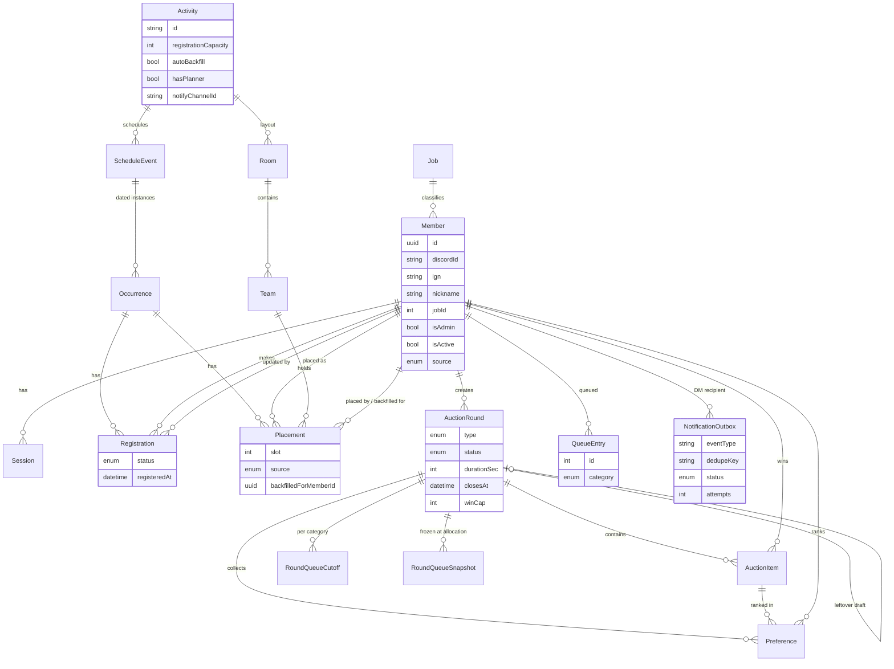

# Clover_TH Backend: Consolidated System Design

Status: FINAL design for implementation, revision 2 (incorporates the Tech Lead review in `docs/design-review.md`; see the last section, "Review response"). Author: Atlas (System Architect).
Inputs: `docs/requirements.md` (v5), the existing frontend in `frontend/`, and user decisions D-1 to D-26.
Guild name: **Clover_TH** (the repository and folder are named Cover_TH). Timezone: Asia/Bangkok, weeks start Monday. Timestamps are stored in UTC.

Tag legend used in impact and change lists: [REQUIRED CHANGE], [RECOMMENDED], [OPTIONAL], [RISK], [BREAKING CHANGE].

---

## 1. Summary of the design

- One Node.js (TypeScript) modular monolith: Fastify 5, Zod, Prisma, PostgreSQL 16. No websockets and no message broker. Members poll every 1 to 2 seconds during a live round.
- Members are keyed everywhere by an immutable UUID. Discord id is a unique string (snowflake, never a JS number).
- Login is Discord OAuth only. Sessions are opaque, stored in the DB, and carried in an HttpOnly cookie. `isAdmin` and `isActive` are read from the DB on every request (no cache), so admin and deactivation changes are immediate. There is no API or UI to grant admin.
- A separate bot API key protects the bot endpoints (register, deactivate). Keys are configuration: env `BOT_API_KEYS` holds up to two sha256 digests for rotation.
- The server clock decides everything: auction windows, click order, queue order, registration order.
- The weekly schedule moves into the DB. `Activity` holds settings (registration capacity, auto-backfill, layout, notification channel). `ScheduleEvent` holds the weekly time rows. `Occurrence` is one event on one date.
- One per-**activity** row lock (`SELECT ... FROM "Activity" WHERE id=$a FOR UPDATE`) serializes registration changes, waitlist promotion, backfill, planner writes, layout, capacity and backfill-setting changes. The `Activity` row always exists, so lazily created occurrences cannot escape the lock. This is what makes promotion and backfill exactly-once. At one guild's scale (transactions of a few ms) per-activity serialization costs nothing measurable.
- Auction rounds use a per-round row lock: member writes (claim, release, submit preferences, queue-cutoff readers) take `FOR SHARE`, finalize and admin close take `FOR UPDATE`, so no accepted write can be missed by allocation.
- Type-1 auctions decide the winner with one conditional `UPDATE` plus a per-member advisory lock for the cap. Type-2 allocation is a pure function of stored inputs.
- Discord notifications use a generic transactional outbox plus an in-process worker (SKIP LOCKED, retries with backoff, per-row status, dedupe key). Delivery never blocks or rolls back a promotion.
- All ids are `Int` (or UUID for members). All time comparisons are DB-side (`clock_timestamp()`).

## 2. Deviations and notes (where this design differs from, or interprets, requirements.md)

1. **Activity and ScheduleEvent are split.** Requirements treat "Guild League" as one activity with three weekly occurrences and per-activity settings. So `Activity` (settings, layout) has many `ScheduleEvent` rows (guild-league-tue-1, guild-league-tue-2, guild-league-thu). Event ids keep the existing frontend slugs, so the `YYYY-MM-DD:eventId` key still works. "Copy previous week" copies the same event one week earlier.
2. **Slot numbers are stored.** FR-5.3 and FR-5.13 say a slot holds one member and backfill fills the exact vacated slot, and FR-6.3 names the slot in messages. So `Placement` has `slot` (1..team size), unique per team per occurrence. The admin UI can leave the slot blank and the server picks the lowest free one.
3. **Registration time and waitlist promotion.** FR-4.6 says the time is the most recent transition into joined. I keep the original registration time when a waitlisted member is promoted to joined by the system (the member did not act again), and reset it on any member or admin transition from leave or none into joined or waitlisted. Needs PO confirmation, and only matters where a capacity is set on an activity that also has auto-backfill (not the default anywhere). A `WAITLISTED` member requesting `JOINED` again is a no-op while capacity is full (keeps `registeredAt`).
4. **"Incomplete" member (FR-1.9), derived.** No stored flag. `isIncomplete = (nickname IS NULL) OR (source = MANUAL)`. The list is `GET /admin/members?incomplete=1`. There is no `needsReview`, no `mark-reviewed` and no `adminEditedFields`: an admin edit that fills the nickname clears the condition naturally. FR-1.9 also mentions records "edited by other means"; this design reads that as "created by other means" (`source = MANUAL`, none in v1 because members cannot be created outside the bot). Needs PO confirmation; if the PO wants admin edits to flag a record, a sticky flag can be added later.
5. **Bot is authoritative for the fields it sends.** A bot upsert overwrites `ign` and `job`, and `nickname` only when the payload includes one. A bot upsert for a deactivated member reactivates it, but reactivation must pass the IGN uniqueness check (`DUPLICATE_IGN`). Not covered by the requirements. Default: as stated.
6. **Notification channel.** FR-6.2 puts the channel id in Activity settings, so it is stored per activity (`Activity.notifyChannelId`). There is no routing table (one event type in v1, FR-6.6). With no channel set, no channel post is made (FR-6.2). DM and channel delivery as a whole is switched by env `NOTIFICATIONS_PROVIDER` (`bot`, `fake`, `off`).
7. **Undo of a backfill and pending messages (O-4).** No new message is sent on undo, and already-queued messages are not cancelled or retracted (simplest default; the PO may ask for cancellation later).
8. **After-start backfill.** Per FR-5.18, no backfill after the occurrence starts. A withdrawal after start (admin only) with auto-backfill ON still removes the member from the slot and leaves it empty (FR-5.14).
9. **Type-1 category restriction.** Type-1 rounds accept any category (needed for leftover rollover). Type-2 rounds accept only Gear, Card, Relic.
10. **"Withdrawn" flag (FR-5.10).** The plan API returns `regStatus` for each placement, and the UI labels LEAVE or NONE as withdrawn. The server does not store a separate withdrawn flag.
11. **Layout shrink check (FR-5.9)** looks at not-yet-started occurrences only, and rejects when any placed member's team would disappear or their slot number would exceed the new team size. It runs under the activity lock, so it cannot race with lazily created occurrences or placements.
12. **Login response (FR-1.1).** Login returns a cookie and a redirect, and the JSON member profile is served by `GET /me`. This is the standard OAuth shape. Needs PO confirmation of the interpretation.
13. **Copy-from-previous (FR-5.7).** Copies every member whose account is active (members no longer JOINED are copied and shown flagged through `regStatus`, not dropped). Skipped: deactivated members and teams that no longer exist or slots beyond a team's current size. It is rejected with `PLAN_NOT_EMPTY` (409) unless the target plan is empty; the admin calls `clear` first.
14. **Arrival order (FR-2.7).** Row-lock wake-up order under contention is not guaranteed FIFO. Exactly one winner is still guaranteed (first committed conditional UPDATE), and `wonAt` is `clock_timestamp()`. Arrival order is approximate under contention.

---

## 3. Architecture

### 3.1 Stack and libraries

| Concern | Choice |
|---|---|
| Runtime | Node 22, TypeScript |
| HTTP | Fastify 5, `@fastify/cookie`, `@fastify/helmet`, `@fastify/rate-limit` |
| Validation | Zod via `fastify-type-provider-zod` (`.strict()` on bodies) |
| DB | PostgreSQL 16, Prisma (`$queryRaw` for locks and atomic statements) |
| Time | Luxon (Bangkok dates) |
| Logging | Pino (redact `x-bot-key`, `authorization`, cookies, OAuth `code`; no request bodies on bot routes) |
| Tests | Vitest, real Postgres (docker compose or testcontainers); frontend: Vitest, Testing Library, MSW |
| API types | `@fastify/swagger` plus the Zod type provider wired in WP1. OpenAPI is generated from the routes in every backend WP, and `openapi-typescript` types are generated for the frontend from WP3 onward |

Alternative considered: Express. Fastify gives schema validation and speed without added complexity.

### 3.2 Project structure

```
backend/
  prisma/{schema.prisma, migrations/, seed.ts}
  src/
    server.ts  app.ts  config/env.ts
    plugins/{session, requireAdmin, botAuth, csrf, errorHandler, requestId}.ts
    lib/{time.ts, errors.ts, locks.ts, audit.ts, occurrence.ts}
      -- locks.ts is the ONLY place locks are taken: withActivityLock(tx, activityId),
         withRoundLock(tx, roundId, 'SHARE'|'UPDATE'), categoryLocks(tx, categories).
         Global lock order (documented in the file header): Activity, then Round,
         then category/member advisory locks (sorted), then rows.
    modules/
      auth/  bot/  members/  jobs/  activities/  events/
      registrations/  planner/  audit/
      notifications/{outbox.ts, worker.ts, providers/{bot,fake}.ts, templates/, routes.ts}
      auctions/{rounds.ts, liveClaim.ts, queue.ts, preferences.ts,
                allocation.ts (PURE), finalizer.ts, sweeper.ts}
      (hot-path raw SQL lives in one file per module, e.g. liveClaim.ts, backfill.ts, queue.ts)
  scripts/{grant-admin.ts, bulk-import-members.ts, replay-allocation.ts, hash-bot-key.ts}
  test/{golden, concurrency, e2e, authz}
```

### 3.3 Time model

- Occurrence date is a Bangkok calendar `DATE`. `startsAt = date + ScheduleEvent.startTime` interpreted in `Asia/Bangkok`, stored as UTC. Thailand has no DST, so this is safe.
- `Occurrence` rows are created lazily by **writes only**, under the Activity lock, with raw `INSERT ... ON CONFLICT ("eventId","date") DO NOTHING` followed by `SELECT` (not Prisma `upsert`, which is not atomic). The date's weekday must equal `ScheduleEvent.dayOfWeek` (`INVALID_OCCURRENCE_DATE`). Reads and writes are limited to a window of about plus or minus 8 weeks from today. **Reads never create rows**: `GET /registrations` and `GET .../plan` for a missing occurrence return empty data.
- Auction, queue, registration and window timestamps use `clock_timestamp()` in SQL, not the app clock and not `now()` (which is the transaction start time). All comparisons (`opensAt`, `closesAt`, `startsAt`) are made DB-side inside the transaction, after any lock wait. `opensAt`/`closesAt` are also computed from `clock_timestamp()` at start.
- Dates are `YYYY-MM-DD` strings at every boundary. Never build them from a local-time JS `Date` (Prisma returns `@db.Date` as a UTC-midnight `Date`; convert with Luxon in `Asia/Bangkok`). `dayOfWeek` is 0 = Monday (frontend and DB), unlike Luxon `weekday` (1 = Monday) and JS `getDay()` (0 = Sunday); convert in `lib/time.ts` only. Table-driven tests around 00:00 Bangkok (17:00 UTC the previous day).
- **BigInt is not used.** All ids are `Int` (one guild never approaches 2^31 rows), so JSON serialization and cursors need no special handling.

### 3.4 Environment configuration

| Variable | Purpose |
|---|---|
| `DATABASE_URL` | Postgres. Must include `connection_limit` (about 20 to 25, below Postgres `max_connections`) and `pool_timeout` (for example `?connection_limit=25&pool_timeout=10`) |
| `PRISMA_TX_MAX_WAIT_MS`, `PRISMA_TX_TIMEOUT_MS` | Interactive transaction `maxWait` (default 10000) and `timeout` (default 5000) used by the shared `tx()` helper |
| `SESSION_SECRET` | Signs the OAuth state cookie |
| `DISCORD_CLIENT_ID`, `DISCORD_CLIENT_SECRET`, `DISCORD_REDIRECT_URI` | OAuth |
| `FRONTEND_URL` | Post-login redirect and Origin check (dev: `http://localhost:5173`) |
| `BOT_API_KEYS` | Comma-separated sha256 hex digests of inbound bot keys (one or two, for rotation). Generate with `scripts/hash-bot-key.ts` |
| `NOTIFICATIONS_PROVIDER` | `bot`, `fake` or `off` |
| `DISCORD_BOT_NOTIFY_URL`, `DISCORD_BOT_NOTIFY_SECRET` | Outbound push to the bot (HMAC key) |

URLs and secrets come only from env. The channel id and the auto-backfill toggle are DB settings.

Prisma pool rule (B3): every claim, release and queue join is an interactive transaction holding a pooled connection for about 6 round trips, so the default pool (`num_cpus*2+1`) and default `maxWait` (2 s) would fail under 80 concurrent claims. All transactions go through one `tx(fn)` helper that applies `{ maxWait, timeout }` from env. A Prisma `P2028` (could not start a transaction in time) is mapped to a retryable `503 SERVICE_BUSY`, `P2034` (serialization or deadlock) is retried once. If the WP8 load test (80 parallel claims, p95 under 200 ms, no `P2028`) is not met with interactive transactions, the claim, release and queue-join paths switch to a single-statement raw path: one `$queryRaw` (or a small plpgsql function) that takes the advisory lock, checks the window and cap, does the conditional UPDATE and writes the audit row in one round trip. The decision is made by measurement in WP8, but the pool settings are part of WP1 and the test harness uses the same settings.

### 3.5 Deployment shape

One Node container plus managed Postgres, TLS, reverse proxy serving the frontend and `/api` on the same origin (Vite dev proxy locally). Run one API instance: the notification worker and the round sweeper are in-process (still correct with more instances because of row locks and `SKIP LOCKED`, just wasteful). Dev setup: the Vite proxy makes the browser see one origin, the Origin check allows `FRONTEND_URL` (`http://localhost:5173`), and `Secure` cookies work on `localhost` in modern browsers. In production the cookie is named with the `__Host-` prefix. `prisma migrate deploy` on release. Health endpoint `GET /healthz`. Backups and point-in-time recovery on the DB.

---

## 4. Data model

### 4.1 ER diagram



### 4.2 Prisma schema

Every reference to another row is a real `@relation` (a real FK) with an explicit `onDelete`, and back-relation fields are included, so the schema passes `prisma validate`. Lines starting `// RAW SQL` are migration additions Prisma cannot express (kept in one dedicated, clearly named migration, and guarded in CI, see 4.4).

**Referential integrity rule (B5).**

| Reference | onDelete | Reason |
|---|---|---|
| Any `Member` FK (`winnerId`, `createdById`, `QueueEntry.memberId`, `Preference.memberId`, `RoundQueueSnapshot.memberId`, `NotificationOutbox.recipientMemberId`, `Registration.memberId/updatedById`, `Placement.memberId/placedById/backfilledForMemberId`) | Restrict | Members are never hard-deleted (they are deactivated) |
| `Session.memberId` | Cascade | Sessions are disposable |
| `Preference` to `AuctionRound` and `AuctionItem`; `RoundQueueCutoff` and `RoundQueueSnapshot` to `AuctionRound`; `AuctionItem.roundId` | Cascade | Owned by the round |
| `AuctionRound.sourceRoundId` (named self-relation `LeftoverDraft`) | SetNull | Draft outlives a deleted source only in theory (rounds are not deleted) |
| `Registration`, `Placement` to `Occurrence` | Cascade | Owned by the occurrence |
| `Member.jobId`, `Team.roomId`, `Room.activityId`, `ScheduleEvent.activityId`, `Occurrence.eventId`, `Placement.teamId` | Restrict | Nothing is deleted while referenced (job in use cannot be deleted; teams and rooms are archived) |
| `AuditLog` actor and entity ids | none (plain text) | History must survive any deletion |

```prisma
generator client { provider = "prisma-client-js" }
datasource db { provider = "postgresql"  url = env("DATABASE_URL") }

enum MemberSource      { BOT MANUAL }
enum AuctionType       { LIVE_CLAIM QUEUE_RANKED }            // type 1 / type 2
enum RoundStatus       { DRAFT OPEN CLOSED CANCELLED }
enum ItemCategory      { PET MATERIAL GEMBOX GEAR CARD RELIC }
enum RegistrationStatus{ JOINED WAITLISTED LEAVE }            // "none" = no row
enum WinSource         { CLAIM ALLOCATION }
enum PlacementSource   { ADMIN COPY AUTO_BACKFILL }
enum BackfillReason    { UNREGISTERED LEAVE DEACTIVATED }
enum ActorType         { MEMBER BOT SYSTEM }
enum NotifyTarget      { DISCORD_DM DISCORD_CHANNEL }
enum NotifyStatus      { PENDING SENDING SENT DEAD }          // PENDING also means "waiting to retry"

// ---------- Identity ----------
model Job {
  id        Int      @id @default(autoincrement())
  label     String   @unique
  color     String
  sortOrder Int      @default(0)
  members   Member[]                       // FK onDelete: Restrict => an in-use job cannot be deleted
}
// Job ids 1..8 are seeded explicitly; the seed then resets the sequence (see 4.3).

model Member {
  id                String       @id @default(uuid()) @db.Uuid    // immutable key used everywhere
  discordId         String       @unique                          // snowflake as TEXT
  ign               String                                        // display name; required
  nickname          String?                                       // optional
  jobId             Int                                           // required (bot rejects missing/invalid job)
  job               Job          @relation(fields: [jobId], references: [id], onDelete: Restrict)
  isAdmin           Boolean      @default(false)                  // set via CLI/SQL only
  isActive          Boolean      @default(true)
  deactivatedAt     DateTime?
  source            MemberSource @default(BOT)                    // isIncomplete = nickname IS NULL OR source = MANUAL (derived, no flag)
  createdAt         DateTime     @default(now())
  updatedAt         DateTime     @updatedAt
  sessions          Session[]
  registrations     Registration[]  @relation("RegistrationMember")
  regUpdates        Registration[]  @relation("RegistrationUpdatedBy")
  placements        Placement[]     @relation("PlacementMember")
  placedBy          Placement[]     @relation("PlacementPlacedBy")
  backfilledFor     Placement[]     @relation("PlacementBackfilledFor")
  wonItems          AuctionItem[]
  createdRounds     AuctionRound[]
  queueEntries      QueueEntry[]
  preferences       Preference[]
  snapshots         RoundQueueSnapshot[]
  notifications     NotificationOutbox[]
  // RAW SQL: CREATE UNIQUE INDEX member_ign_active
  //          ON "Member"(lower(normalize(ign, NFC))) WHERE "isActive";
  //   (verify normalize() is usable in an index expression on the target PG and the DB is UTF8: WP2 test)
}

model Session {                          // opaque server-side session
  id        String   @id                 // sha256(cookie token)
  memberId  String   @db.Uuid
  member    Member   @relation(fields: [memberId], references: [id], onDelete: Cascade)
  createdAt DateTime @default(now())
  expiresAt DateTime
  lastSeen  DateTime @default(now())       // refreshed at most once per hour per session (no per-request write)
  @@index([memberId])
}
// There is no BotApiKey table: inbound bot keys are env `BOT_API_KEYS` (sha256 digests, max two).

// ---------- Schedule, registration, planner ----------
model Activity {                         // settings live here; ALSO the write lock row (see 7.3)
  id                   String  @id       // slug: "guild-league", "polarity-zone", ...
  name                 String
  isGuild              Boolean @default(false)
  hasPlanner           Boolean @default(false)
  registrationCapacity Int?              // null = unlimited (default for ALL activities)
  autoBackfill         Boolean @default(false)   // seed: true for polarity-zone only
  notifyChannelId      String?           // Discord channel snowflake (TEXT); null => no channel post
  sortOrder            Int     @default(0)
  events               ScheduleEvent[]
  rooms                Room[]
  // RAW SQL: CHECK (NOT "autoBackfill" OR "hasPlanner")
}

model ScheduleEvent {                    // weekly time row; id = existing frontend event id
  id         String   @id                // "guild-league-tue-1", "mirror-world", ...
  activityId String
  activity   Activity @relation(fields: [activityId], references: [id], onDelete: Restrict)
  dayOfWeek  Int                         // 0 = Monday
  startTime  String                      // "21:30" Bangkok wall time
  endTime    String
  sortOrder  Int      @default(0)
  occurrences Occurrence[]
}

model Occurrence {                       // lazily created by writes (raw INSERT ON CONFLICT DO NOTHING); data row only, NOT a lock
  id          Int           @id @default(autoincrement())
  eventId     String
  event       ScheduleEvent @relation(fields: [eventId], references: [id], onDelete: Restrict)
  date        DateTime      @db.Date     // Bangkok calendar date
  startsAt    DateTime                   // UTC
  planVersion Int           @default(0)  // optimistic lock for planner writes
  registrations Registration[]
  placements    Placement[]
  @@unique([eventId, date])
}

model Registration {
  id           Int                @id @default(autoincrement())
  occurrenceId Int
  memberId     String             @db.Uuid
  status       RegistrationStatus
  registeredAt DateTime           // reserve/waitlist order key (see 7.3 for the reset rule)
  updatedById  String?            @db.Uuid    // no updatedAt column: nothing reads it
  occurrence   Occurrence         @relation(fields: [occurrenceId], references: [id], onDelete: Cascade)
  member       Member             @relation("RegistrationMember", fields: [memberId], references: [id], onDelete: Restrict)
  updatedBy    Member?            @relation("RegistrationUpdatedBy", fields: [updatedById], references: [id], onDelete: Restrict)
  @@unique([occurrenceId, memberId])
  @@index([occurrenceId, status, registeredAt])
}

model Room {                             // layout is DATA, per activity
  id         Int       @id @default(autoincrement())
  activityId String
  key        String                       // "main" | "sub" | "default"
  name       String
  sortOrder  Int       @default(0)
  archivedAt DateTime?
  activity   Activity  @relation(fields: [activityId], references: [id], onDelete: Restrict)
  teams      Team[]
  // RAW SQL: CREATE UNIQUE INDEX room_key_live ON "Room"("activityId","key") WHERE "archivedAt" IS NULL;
  //   (partial, so an archived room's key can be re-created; room capacity sums non-archived teams only)
}

model Team {
  id         Int       @id @default(autoincrement())
  roomId     Int
  name       String
  size       Int       @default(5)        // slots; room capacity = SUM(size), never stored
  sortOrder  Int       @default(0)
  archivedAt DateTime?                    // teams with placements are archived, never hard-deleted
  room       Room      @relation(fields: [roomId], references: [id], onDelete: Restrict)
  placements Placement[]
}

model Placement {
  id                    Int             @id @default(autoincrement())
  occurrenceId          Int
  memberId              String          @db.Uuid
  teamId                Int
  slot                  Int                        // 1..team.size
  source                PlacementSource @default(ADMIN)
  backfilledForMemberId String?         @db.Uuid   // who vacated the slot
  backfillReason        BackfillReason?
  placedById            String?         @db.Uuid   // null for system backfill
  placedAt              DateTime        @default(now())
  occurrence            Occurrence      @relation(fields: [occurrenceId], references: [id], onDelete: Cascade)
  team                  Team            @relation(fields: [teamId], references: [id], onDelete: Restrict)
  member                Member          @relation("PlacementMember", fields: [memberId], references: [id], onDelete: Restrict)
  placedBy              Member?         @relation("PlacementPlacedBy", fields: [placedById], references: [id], onDelete: Restrict)
  backfilledFor         Member?         @relation("PlacementBackfilledFor", fields: [backfilledForMemberId], references: [id], onDelete: Restrict)
  @@unique([occurrenceId, memberId])                // one slot per occurrence across ALL rooms
  @@unique([occurrenceId, teamId, slot])            // one member per slot
  // RAW SQL: CHECK (slot >= 1)
}

// ---------- Auctions ----------
model AuctionRound {
  id               Int          @id @default(autoincrement())
  type             AuctionType
  name             String
  status           RoundStatus  @default(DRAFT)
  durationSec      Int          @default(300)
  winCap           Int?                       // LIVE_CLAIM only (default 5, admin may override); NULL for QUEUE_RANKED (allocate() fixes 1 per category)
  startDelaySec    Int          @default(3)   // matches the frontend 3-2-1 countdown
  opensAt          DateTime?                  // server-set at start
  closesAt         DateTime?
  closedAt         DateTime?
  allocatedAt      DateTime?                  // set once => allocation is idempotent
  algorithmVersion Int?
  sourceRoundId    Int?         @unique       // leftover draft <- the type-2 round it came from
  sourceRound      AuctionRound? @relation("LeftoverDraft", fields: [sourceRoundId], references: [id], onDelete: SetNull)
  leftoverDraft    AuctionRound? @relation("LeftoverDraft")
  createdById      String       @db.Uuid
  createdBy        Member       @relation(fields: [createdById], references: [id], onDelete: Restrict)
  createdAt        DateTime     @default(now())
  items            AuctionItem[]
  cutoffs          RoundQueueCutoff[]
  snapshots        RoundQueueSnapshot[]
  preferences      Preference[]
  // RAW SQL: CREATE UNIQUE INDEX one_open_per_type ON "AuctionRound"(type) WHERE status = 'OPEN';
  // RAW SQL: CHECK ((type = 'LIVE_CLAIM') = ("winCap" IS NOT NULL))
}

model AuctionItem {                      // one row = one unit
  id        Int          @id @default(autoincrement())
  roundId   Int
  round     AuctionRound @relation(fields: [roundId], references: [id], onDelete: Cascade)
  name      String
  category  ItemCategory
  rarity    String?
  imageUrl  String?                       // v1: admin-pasted URL only
  sortOrder Int          @default(0)
  winnerId  String?      @db.Uuid         // claim (type 1) or award (type 2)
  winner    Member?      @relation(fields: [winnerId], references: [id], onDelete: Restrict)
  wonAt     DateTime?                     // clock_timestamp() at claim or allocation
  winSource WinSource?
  queuePos  Int?                          // type 2: winner's snapshot position (explainability)
  preferences Preference[]
  @@index([roundId, winnerId])
  // RAW SQL: CHECK (("winnerId" IS NULL) = ("wonAt" IS NULL))
}

model QueueEntry {                       // persistent per-category queue; ORDER BY id
  id       Int          @id @default(autoincrement())   // the id IS the order key
  category ItemCategory                                  // GEAR | CARD | RELIC only
  memberId String       @db.Uuid
  member   Member       @relation(fields: [memberId], references: [id], onDelete: Restrict)
  joinedAt DateTime     @default(dbgenerated("clock_timestamp()"))
  @@unique([category, memberId])
}

model RoundQueueCutoff {                 // "snapshot at window open" = a cutoff id
  roundId  Int
  round    AuctionRound @relation(fields: [roundId], references: [id], onDelete: Cascade)
  category ItemCategory
  cutoffId Int                          // max(QueueEntry.id) at start
  @@id([roundId, category])
}

model RoundQueueSnapshot {               // frozen allocation INPUT, written at allocation for replay
  roundId  Int
  round    AuctionRound @relation(fields: [roundId], references: [id], onDelete: Cascade)
  category ItemCategory
  memberId String   @db.Uuid
  member   Member   @relation(fields: [memberId], references: [id], onDelete: Restrict)
  position Int
  @@id([roundId, category, memberId])
}

model Preference {                       // one ranked list per member per round (items span categories; ranks dense over the whole list, UI sorts per category)
  roundId   Int
  round     AuctionRound @relation(fields: [roundId], references: [id], onDelete: Cascade)
  memberId  String       @db.Uuid
  member    Member       @relation(fields: [memberId], references: [id], onDelete: Restrict)
  itemId    Int
  item      AuctionItem  @relation(fields: [itemId], references: [id], onDelete: Cascade)
  rank      Int                              // no updatedAt column: nothing reads it
  @@id([roundId, memberId, itemId])
  @@unique([roundId, memberId, rank])
}

// ---------- Notifications (generic outbox) ----------
// There is no NotificationRoute table (one event type in v1). Channel id = Activity.notifyChannelId.

model NotificationOutbox {               // one row = one message to one destination
  id                 Int          @id @default(autoincrement())
  eventType          String
  target             NotifyTarget
  recipientMemberId  String?      @db.Uuid    // DM only
  recipient          Member?      @relation(fields: [recipientMemberId], references: [id], onDelete: Restrict)
  recipientDiscordId String?                  // snapshot at enqueue
  channelId          String?                  // snapshot at enqueue
  payload            Json                     // structured event data; text is rendered at send time
  dedupeKey          String       @unique     // "reserve.promoted:{occId}:{memberId}:{planVersion}:dm"
  entityType         String?                  // "occurrence"
  entityId           String?
  status             NotifyStatus @default(PENDING)
  attempts           Int          @default(0)
  maxAttempts        Int          @default(8)
  nextAttemptAt      DateTime     @default(now())
  lockedAt           DateTime?                // lease while SENDING
  lastError          String?
  lastErrorCode      String?                  // DM_CLOSED, HTTP_503, TIMEOUT, ...
  sentAt             DateTime?
  createdAt          DateTime     @default(now())
  updatedAt          DateTime     @default(now())   // set explicitly by the worker's raw statements (Prisma @updatedAt is client-side only)
  @@index([status, nextAttemptAt])
  @@index([entityType, entityId])
}

// ---------- Audit ----------
model AuditLog {                         // deliberately no FKs: ids are plain text so history survives
  id         Int       @id @default(autoincrement())
  at         DateTime  @default(dbgenerated("clock_timestamp()"))
  actorType  ActorType
  actorId    String?                       // memberId; null for BOT / SYSTEM
  action     String                        // "auction.claim", "plan.backfill", "notification.dead", ...
  entityType String
  entityId   String
  meta       Json?
  requestId  String?
  @@index([at(sort: Desc)])
  @@index([action, at])
  @@index([entityType, entityId])
}
```

### 4.3 Seed data

Notes on `updatedAt`: Prisma's `@updatedAt` is client-side only, so every raw `UPDATE` sets `"updatedAt"` explicitly. It is kept only where something reads it (`Member`, `NotificationOutbox`).

- Jobs: the 8 defaults with ids 1 to 8 (unchanged, so existing colours carry over). After seeding: `SELECT setval(pg_get_serial_sequence('"Job"','id'), (SELECT max(id) FROM "Job"))`, so the first admin-created job does not collide. Seeding is idempotent (`upsert` on natural keys).
- Activities (14) and ScheduleEvents (16), with the current frontend event ids. Guild League is one activity with three events. Hazy Forest has `hasPlanner = false`.
- `registrationCapacity = null` for all. `autoBackfill = true` for `polarity-zone` only. `notifyChannelId = null`.
- Default layouts: Guild League Main 12 x 5 (60) and Sub 18 x 5 (90); Polarity Zone one room 10 x 5 (50); Mirror World and Castle Siege one room 8 x 5 (40, placeholders).
- The roster in `guild.ts` has no Discord ids, so it is not seeded. Real members arrive through the bot (`scripts/bulk-import-members.ts`, a one-time bulk upsert for the ~76 existing members, built in WP4). A dev seed creates fake members, including real Thai strings (`แมวกระเป๋า`, `เสีEวค่ะXลวงMา`, `-nara-`) for IGN tests.

### 4.4 Migration guards (B5)

- CI runs `prisma validate` and `prisma migrate diff --from-migrations prisma/migrations --to-schema-datamodel prisma/schema.prisma --shadow-database-url ... --exit-code` on every PR, so the schema file and migrations cannot drift.
- All raw SQL (partial unique indexes on `Member`, `AuctionRound`, `Room`, all CHECK constraints) lives in one dedicated migration named `*_raw_constraints`. A second CI step greps the migration folder for each expected raw statement, so a later `migrate dev` cannot silently drop them.
- IGN uniqueness (FR-1.10): the partial index is over active members. Bot upsert uses `INSERT ... ON CONFLICT ("discordId") DO UPDATE`. Prisma `P2002` is mapped by constraint: the IGN index to `DUPLICATE_IGN`, `discordId` is handled by the upsert. Reactivation (admin or bot) re-checks and returns `DUPLICATE_IGN` on collision.

---

## 5. Authentication, sessions and the bot boundary

**OAuth (Authorization Code with PKCE, scope `identify` only).**
1. `GET /auth/discord/login` sets a short-lived signed cookie (state and PKCE verifier) and redirects to Discord. (PKCE is kept only if Discord's token endpoint accepts `code_verifier` for this app type; otherwise drop PKCE and keep `state`, which is sufficient for a confidential server-side client.)
2. `GET /auth/discord/callback` (rate limited per IP) validates state (a reused or missing state is rejected), exchanges the code, calls `/users/@me`, and discards the Discord tokens.
3. It looks up `Member` by `discordId`. Not found: redirect to `FRONTEND_URL/?authError=AUTH_NOT_REGISTERED` (a query string, so it cannot collide with the hash-route `viewFromHash()`), no session. Inactive: `AUTH_MEMBER_INACTIVE`. Otherwise it creates a `Session` and sets the cookie.
4. Cookie: `HttpOnly; Secure; SameSite=Lax`, named `__Host-session` in production, 30-day sliding expiry.

**Session.** Opaque DB-backed session rather than a JWT. On every request the session, `isAdmin` and `isActive` are read from the DB by primary key (no cache; about 80 rps of a PK lookup is trivial), so admin and deactivation changes take effect immediately. `lastSeen`/`expiresAt` are refreshed at most once per hour per session, so polling does not cause a write per request. CSRF applies to cookie-authenticated non-GET routes only: SameSite=Lax, a required `X-Requested-With` header, and an Origin check. Bot-key routes are exempt from the Origin and header check and reject cookies (both covered by authz-matrix tests). Same-origin `/api`, so no CORS in production. `isAdmin` is never accepted from a client (bodies are `.strict()`). Admin bootstrap is `scripts/grant-admin.ts <discordId>` or SQL.

**Bot (inbound).** Header `X-Bot-Key`. The key is configuration (FR-1.4): env `BOT_API_KEYS` holds one or two sha256 hex digests (two allow zero-downtime rotation). The request key is hashed and compared to each digest with `timingSafeEqual`. Redacted in logs. Bot routes have their own rate limit. Bot routes never accept a member session, and member routes never accept the bot key. Audit rows are written only when a bot upsert creates or changes something, not on an idempotent no-op repeat.

**Bot (outbound notifications).** A separate secret (`DISCORD_BOT_NOTIFY_SECRET`) signs each request with HMAC-SHA256 (section 8.4).

---

## 6. API design

Base path `/api/v1`, JSON. Error shape: `{ "error": { "code": "ITEM_ALREADY_CLAIMED", "message": "English fallback", "details": {} } }`. The frontend translates by `code`. Time-sensitive responses carry `serverTime` (ISO with milliseconds).

Auth column: **P** public, **A** any signed-in member, **M** self or admin, **Adm** admin, **Bot** bot key.

### 6.1 Auth and profile

| Method | Path | Auth | Purpose |
|---|---|---|---|
| GET | /auth/discord/login | P | Redirect to Discord |
| GET | /auth/discord/callback | P | Sets cookie, redirects to the frontend |
| POST | /auth/logout | A | Destroys the session |
| GET | /me | A | `{memberId, discordId, ign, nickname, job:{id,label,color}, isAdmin, isIncomplete, serverTime}` (`isIncomplete` is derived, see deviation 4) |

There is no `GET /time`: every time-sensitive response already carries `serverTime`, and `/me` and the round list carry it before a round loads.

### 6.2 Bot

| Method | Path | Auth | Purpose |
|---|---|---|---|
| PUT | /bot/members/:discordId | Bot | Idempotent upsert (`INSERT ... ON CONFLICT (discordId) DO UPDATE`). Body `{ign, job (label) or jobId, nickname?}`. `ign` and job are required. 201 on create, 200 on update. Reactivates a deactivated member (with the IGN uniqueness check). |
| POST | /bot/members/:discordId/deactivate | Bot | Idempotent. Runs the deactivation side effects (7.6). |

### 6.3 Members and jobs

| Method | Path | Auth | Purpose |
|---|---|---|---|
| GET | /members | A | Active roster `[{id, ign, nickname, jobId}]`. No Discord id or admin flag for non-admins. |
| GET | /admin/members?incomplete=1&includeInactive=1 | Adm | Adds `discordId, isActive, isAdmin, isIncomplete` |
| PATCH | /admin/members/:id | Adm | `{ign?, nickname?, jobId?}`. Duplicate IGN check. |
| POST | /admin/members/:id/deactivate, /reactivate | Adm | Deactivate replaces "delete". Reactivate re-checks IGN (`DUPLICATE_IGN`). |
| GET | /jobs | A | `[{id, label, color, sortOrder, inUse}]` |
| PUT | /admin/jobs | Adm | Atomic replace matching the frontend draft-then-Save flow: entries with `id` update, entries without create, missing ones delete (rejected if in use) |

There is no `POST /members`, no `DELETE /members` and no admin-grant route.

### 6.4 Activities, events, registration

| Method | Path | Auth | Purpose |
|---|---|---|---|
| GET | /activities | A | Settings: `registrationCapacity, autoBackfill, hasPlanner, notifyChannelId (admin only), layout capacity (sum of team sizes)` |
| GET | /events | A | Weekly schedule rows `[{id, activityId, name, isGuild, dayOfWeek, startTime, endTime}]` |
| PATCH | /admin/activities/:id | Adm | `{registrationCapacity?: int or null, autoBackfill?: bool, notifyChannelId?: string or null}`. Runs under the Activity lock. Raising the capacity promotes waitlisted members (across all future occurrences with a waitlist). Lowering never demotes. |
| GET | /registrations?from=YYYY-MM-DD&to=YYYY-MM-DD | A | Max 14 days. Per occurrence: `[{memberId, status, waitlistPos?, placed?, reserveOrder?}]` (`placed` and `reserveOrder` for planner activities). Replaces the frontend `attendance` object. |
| PUT | /events/:eventId/occurrences/:date/registrations/:memberId | M | Body `{status: "JOINED" or "LEAVE" or "NONE"}`. `:memberId` may be `me`. See response below. |

Registration PUT response:
```json
{
  "status": "JOINED",
  "waitlistPosition": null,
  "promoted": ["<memberId>"],
  "backfilled": [{ "teamId": 3, "teamName": "Team 3", "slot": 2,
                   "vacatedMemberId": "...", "promotedMemberId": "...", "reason": "LEAVE" }],
  "planVersion": 12
}
```
- `status` is the resulting state (JOINED may become WAITLISTED when a capacity is full).
- `promoted` lists registration-waitlist promotions. `backfilled` lists planner backfills. Both are empty arrays when nothing happened. `planVersion` is present only when it changed.
- Only an admin may change another member. A non-admin gets `REGISTRATION_CLOSED` once `startsAt <= clock_timestamp()` (checked inside the transaction after the lock). Repeating the same status is a no-op (200, same body, `promoted: []`, `backfilled: []`, nothing changes). The member status object has the same shape everywhere (`/registrations`, this response, the plan).
- Wire enums are uppercase (`JOINED`); the frontend mapping to its `joined`/`leave` strings lives in `src/api/` only.

### 6.5 Planner

| Method | Path | Auth | Purpose |
|---|---|---|---|
| GET | /admin/activities/:id/layout | Adm | Rooms, teams, sizes |
| PUT | /admin/activities/:id/layout | Adm | Replace `{rooms:[{id?, key, name, teams:[{id?, name, size}]}]}` (data only, no code change). Runs under the Activity lock. |
| GET | /events/:eventId/occurrences/:date/plan | A | See shape below |
| PUT | /events/:eventId/occurrences/:date/plan/placements/:memberId | Adm | `{teamId or null, slot?, expectedVersion}` places, moves or unplaces. Slot omitted means lowest free slot. Returns `{version}`. A move sets `source = ADMIN`. **Swap:** if the target slot is occupied by another member, the server swaps the two in one transaction (the occupant moves to the mover's old slot; if the mover was unplaced, the occupant is unplaced instead). Needed for drag-and-drop. |
| POST | /events/:eventId/occurrences/:date/plan/clear | Adm | `{expectedVersion}` |
| POST | /events/:eventId/occurrences/:date/plan/copy-from-previous | Adm | `{expectedVersion, sourceDate?}` copies the same event one week earlier (or `sourceDate`). `409 PLAN_NOT_EMPTY` unless the target plan is empty. Returns `{copied, skipped:[{memberId, reason}]}` where `skipped` contains only deactivated members and teams or slots that no longer exist (see deviation 13). |
| POST | /events/:eventId/occurrences/:date/plan/placements/:memberId/undo-backfill | Adm | `{expectedVersion}`. Only for `source = AUTO_BACKFILL`. Unplaces the member back into the reserves and audits `plan.backfill.undo`. No message is sent or cancelled (deviation 7). |

Plan response:
```json
{
  "version": 12,
  "autoBackfill": true,
  "rooms": [{ "id": 1, "key": "default", "name": "Polarity Zone", "capacity": 50,
    "teams": [{ "id": 3, "name": "Team 3", "size": 5,
      "placements": [{ "memberId": "...", "slot": 2, "regStatus": "JOINED",
                       "source": "AUTO_BACKFILL",
                       "backfill": { "vacatedMemberId": "...", "reason": "LEAVE", "at": "..." } }] }] }],
  "reserves": [{ "memberId": "...", "registeredAt": "...", "order": 1 }]
}
```
- `reserves` is every JOINED, active, unplaced member ordered by `(registeredAt, id)`. It is present for all planner activities.
- A placement whose `regStatus` is not JOINED is flagged (LEAVE or NONE is shown as "withdrawn", WAITLISTED or NONE-never-registered as "not registered").
- Room capacity is `sum(team.size)`, computed.

### 6.6 Auctions (members)

| Method | Path | Auth | Purpose |
|---|---|---|---|
| GET | /auctions/rounds?status= | A | Summaries |
| GET | /auctions/rounds/:id | A | `{type, status, opensAt, closesAt, serverTime, winCap, items:[{id, name, category, rarity, imageUrl, winner:{memberId, wonAt}}], myWinCount}`. No server cache (one small query at about 80 rps). Optional `ETag` computed from `max(wonAt)`, item count and status, not by serializing the body. |
| POST | /auctions/rounds/:id/items/:itemId/claim | A | Type 1. Returns the item and `myWinCount`. Idempotent for the current winner: retrying a claim the caller already won returns 200 with the item. |
| DELETE | /auctions/rounds/:id/items/:itemId/claim | A | Release own claim while the window is open |
| GET | /auctions/rounds/:id/results | A | After close: winners per item with `wonAt` (type 1) or `queuePos` (type 2), and `leftoverRoundId` |
| GET | /auctions/rounds/:id/results/me | A | Own wins only (dropped connections). Available during and after the round. |
| GET | /auctions/queues | A | Per category `{length, myRank or null, entries:[{rank, memberId}]}` |
| PUT | /auctions/queues/:category/me | A | Join (idempotent). Category is GEAR, CARD or RELIC. |
| DELETE | /auctions/queues/:category/me | A | Leave |
| PUT | /auctions/rounds/:id/preferences/me | A | `{itemIds:[ordered]}` replaces the whole list; `[]` clears it. Ranks are dense over the whole list (no per-category contiguity is enforced; the UI orders within a category). |
| GET | /auctions/rounds/:id/preferences/me | A | Own list only |

### 6.7 Admin: auctions, notifications, audit

| Method | Path | Purpose |
|---|---|---|
| POST | /admin/auctions/rounds | Create a DRAFT `{type, name, durationSec?, winCap? (type 1 only, default 5), items:[{name, category, rarity?, imageUrl?}]}` |
| PATCH | /admin/auctions/rounds/:id | Edit a draft: name, duration, items (replace) |
| POST | /admin/auctions/rounds/:id/start | `{startDelaySec?, durationSec?}`. Server sets `opensAt = clock_timestamp() + delay`, `closesAt = opensAt + duration`, and records queue cutoffs for type 2. |
| POST | /admin/auctions/rounds/:id/close | Early close under the round `FOR UPDATE` lock. Sets `status = CLOSED` and `closesAt = clock_timestamp()` in one statement (type 2 then allocates). No extension of a running round. |
| POST | /admin/auctions/rounds/:id/cancel | Cancel a draft or open round. The queue is unchanged. |
| GET | /admin/auctions/rounds/:id/preferences | Type 2: all members' lists |
| GET | /admin/notifications?status=&eventType=&cursor=&limit= | Outbox view with counts by status; payload shown without more PII than names and ids |
| POST | /admin/notifications/:id/retry | DEAD or PENDING back to PENDING now |
| GET | /admin/audit-log?cursor=&limit=&actor=&action=&from=&to= | Read-only audit view |

The leftover draft is an ordinary DRAFT round (`sourceRoundId` set). The admin reviews, edits and starts it through the normal endpoints. Allocation replay (FR-3.12) is a script, `scripts/replay-allocation.ts <roundId>`, and a test helper, not an endpoint.

### 6.8 Error codes

| Code | HTTP | Meaning |
|---|---|---|
| AUTH_REQUIRED | 401 | No or expired session |
| AUTH_NOT_REGISTERED | 403 | Discord user not registered by the bot |
| AUTH_MEMBER_INACTIVE | 403 | Member is deactivated |
| AUTH_OAUTH_FAILED | 400 | OAuth exchange failed |
| ADMIN_REQUIRED | 403 | Admin-only endpoint |
| FORBIDDEN_OTHER_MEMBER | 403 | Member tried to change someone else |
| BOT_KEY_INVALID | 401 | Missing or wrong bot key |
| INVALID_JOB | 422 | Job missing or not in the job list (bot and admin) |
| DUPLICATE_IGN | 409 | In-game name already used by an active member (also on reactivation) |
| DUPLICATE_JOB_LABEL, JOB_IN_USE | 409 | Job management conflicts |
| VALIDATION_ERROR | 422 | Body or parameter failed validation |
| MEMBER_NOT_FOUND, NOT_FOUND | 404 | Unknown id |
| MEMBER_INACTIVE | 422 | Action targets a deactivated member |
| INVALID_OCCURRENCE_DATE | 422 | Date does not match the event's weekday or is out of range |
| REGISTRATION_CLOSED | 409 | Occurrence already started (non-admin) |
| ACTIVITY_HAS_NO_PLANNER | 404 | Planner endpoint on a registration-only activity |
| AUTO_BACKFILL_REQUIRES_PLANNER | 422 | Enabling backfill on an activity without a planner |
| PLAN_VERSION_CONFLICT | 409 | Stale `expectedVersion`; `details` carries the current plan (about 10 KB for a 150-slot layout, acceptable) |
| TEAM_FULL, SLOT_TAKEN | 409 | Placement state conflicts |
| SLOT_OUT_OF_RANGE | 422 | Slot outside 1..team size (malformed input) |
| PLAN_NOT_EMPTY | 409 | Copy-from-previous into a non-empty plan |
| SERVICE_BUSY | 503 | Retryable: DB pool or transaction start timeout (Prisma P2028) |
| TEAM_NOT_IN_ACTIVITY | 422 | Team belongs to another activity |
| LAYOUT_BELOW_PLACED | 409 | Layout change would orphan placed members; `{teamId, placed, size}` |
| NOT_AN_AUTO_BACKFILL | 409 | Undo on a placement that is not auto-backfilled |
| ROUND_NOT_OPEN, ROUND_CLOSED | 409 | Claim or preference outside the window |
| ROUND_NOT_DRAFT, ROUND_EMPTY, ANOTHER_ROUND_OPEN | 409 | Round lifecycle conflicts (one OPEN round per type) |
| ROUND_TYPE_MISMATCH | 409 | Claim on a queue round or vice versa |
| INVALID_CATEGORY_FOR_TYPE | 422 | Type-2 round with a non Gear/Card/Relic item |
| ITEM_ALREADY_CLAIMED | 409 | `details` names the winner |
| CLAIM_CAP_REACHED | 409 | 6th claim |
| NOT_YOUR_CLAIM | 403 | Release of someone else's claim |
| NOT_ELIGIBLE_FOR_CATEGORY | 409 | Not in the round's queue snapshot for that category |
| INVALID_PREFERENCE_LIST | 422 | Duplicate, unknown or wrong-round item |
| INVALID_QUEUE_CATEGORY | 422 | Queue category is not Gear, Card or Relic |
| NOTIFICATION_NOT_RETRYABLE | 409 | Retry on a SENT row |
| RATE_LIMITED | 429 | Too many requests |

---

## 7. Algorithms and concurrency

### 7.1 Type 1: live claim

```
BEGIN;   -- via tx() with maxWait/timeout from env (section 3.4)
  -- lock order: round (SHARE), then member advisory lock, then rows
  SELECT status, "opensAt", "closesAt", "winCap", type
    FROM "AuctionRound" WHERE id = $round FOR SHARE;
  --   require type='LIVE_CLAIM' AND status='OPEN'
  --           AND clock_timestamp() BETWEEN opensAt AND closesAt
  --   (FOR SHARE: many members proceed together, but admin close/finalize takes FOR UPDATE and
  --    waits for in-flight claims; later claims then see CLOSED. No claim can commit after close returned.)

  -- serialize one member's claims so two tabs cannot exceed the cap
  SELECT pg_advisory_xact_lock(hashtextextended('claim:'||$round||':'||$me, 0));

  -- idempotent retry: if the caller is already the winner, return 200 with the item (BEFORE the cap check,
  -- so a retry at 5/5 does not return CLAIM_CAP_REACHED for an item the member owns)
  SELECT "winnerId" FROM "AuctionItem" WHERE id=$item AND "roundId"=$round;   -- = $me => return item

  -- cap
  SELECT count(*) FROM "AuctionItem" WHERE "roundId"=$round AND "winnerId"=$me;   -- >= winCap => CLAIM_CAP_REACHED

  -- single winner: one conditional write decides
  UPDATE "AuctionItem"
     SET "winnerId"=$me, "wonAt"=clock_timestamp(), "winSource"='CLAIM'
   WHERE id=$item AND "roundId"=$round AND "winnerId" IS NULL
  RETURNING ...;                       -- 0 rows => ITEM_ALREADY_CLAIMED (read current winner for details)

  INSERT INTO "AuditLog" ...;          -- same transaction
COMMIT;
```

- Concurrent claims on one item: the second `UPDATE` waits on the row lock, re-evaluates `winnerId IS NULL` after the first commits and matches zero rows. Read Committed is sufficient.
- Release takes the same round `FOR SHARE` and window check, then `UPDATE ... SET winnerId=NULL, wonAt=NULL WHERE id=$item AND winnerId=$me`. The cap uses a live `count`, so a released item frees a slot with no counter to drift. Queue join and leave do not need the round lock.
- Closing (admin early close or expiry) is an `UPDATE` of the round under `FOR UPDATE`, and every claim re-checks `clock_timestamp() <= closesAt`. A late sweeper cannot admit late claims, and an admin close cannot be overtaken by a claim that committed after it returned.
- "First click wins" is really first arrival at the server, approximate under contention (deviation 14). This is inherent and documented (risks).
- Polling: no server cache. About 80 members polling is roughly 40 to 80 requests per second of one small query (round row plus at most about 80 items).
- Pool: see section 3.4. If interactive transactions do not meet p95 under 200 ms at 80 parallel claims in WP8, this whole block becomes one raw statement or plpgsql function (one round trip) with identical semantics.

### 7.2 Type 2: queue, preferences, allocation

**Queue.** `QueueEntry.id` (autoincrement) is the order key. Join and leave take `pg_advisory_xact_lock('queue:'||category)`, so id order equals commit order. Rank is `count(entries with id < mine) + 1`. Leaving deletes the row.

**Start.** Inside the same category locks, record `RoundQueueCutoff(roundId, category, max(id))` for each category present in the round. Entries with `id <= cutoff` are eligible. Joins during the window get a larger id and go to the tail, ineligible. A member who leaves during the window loses eligibility for this round and rejoining puts them at the tail (ineligible).

**Submit preferences (window open).** First `SELECT ... FROM "AuctionRound" WHERE id=$r FOR SHARE`, then check `status='OPEN' AND clock_timestamp() <= closesAt`, then write (B2). Finalize and admin close take `FOR UPDATE` on the same row, so a submit either completes before finalize reads `Preference` rows or sees `CLOSED`. A 200 therefore always means the list is part of the stored allocation inputs. Delete then insert the member's list. Every item must belong to the round and to a category where the member has an entry with `id <= cutoff` (`NOT_ELIGIBLE_FOR_CATEGORY`). Ranks are dense 1..n.

**Finalize** (`finalizeRound(roundId)`, idempotent). Triggered by three paths: an in-process 5 second sweeper for OPEN rounds past `closesAt`, lazy triggering when an expired OPEN round is read, and the admin close endpoint.

```
BEGIN;
  SELECT ... FROM "AuctionRound" WHERE id=$r FOR UPDATE;
  if allocatedAt IS NOT NULL: return stored results            -- idempotent
  -- lock order: round (FOR UPDATE, above), then category advisory locks, then rows
  take advisory locks per category (in sorted order to avoid deadlocks)
  for each category c in the round:
      snapshot[c] = QueueEntry WHERE category=c AND id <= cutoff(r,c) ORDER BY id
      persist RoundQueueSnapshot(r, c, member, position)       -- frozen input for replay
  awards = allocate(snapshot, items, prefs)                    -- PURE, no DB access
  write AuctionItem.winnerId/wonAt/winSource='ALLOCATION'/queuePos
  requeue: for each category, for each winner in ORIGINAL queue order:
           DELETE the winner's QueueEntry; INSERT a new one (fresh id => tail)
  leftovers = round items with no winner (includes items whose listers all lost)
  if leftovers not empty:
      INSERT AuctionRound(type=LIVE_CLAIM, status=DRAFT, sourceRoundId=r) + copy items
  UPDATE round SET status='CLOSED', closedAt=clock_timestamp(), allocatedAt=clock_timestamp(), algorithmVersion=1
  audit rows (submissions were audited at submit time; allocation and requeue here)
COMMIT;
```

**Pure allocation function.**
```
allocate(queues, items, prefs):
  for each category c:
    free = { i in items : i.category == c }
    for (pos, m) in queues[c]:                      # snapshot order
      list = prefs[m] filtered to category c, sorted by rank
      pick = first i in list with i in free
      if pick: award(pick, m, pos); free.remove(pick)
  return awards          # at most one per member per category by construction
```

**Golden test (AC-4).** Queue A, B, C, D, E. Five gear items 1 to 5. Lists A=(1,3), B=(1,3), C=(3,2).
- A: item 1 is free, so A wins 1.
- B: item 1 is taken, item 3 is free, so B wins 3.
- C: item 3 is taken, item 2 is free, so C wins 2.
- D and E listed nothing and win nothing.
- Winners in queue order are A, B, C and are re-inserted at the tail. The queue after allocation is **D, E, A, B, C**.
- Items 4 and 5 are leftovers and become a DRAFT type-1 round.

Further tests: a member with no list keeps position; one win per category with multi-category lists; a latecomer (joined during the window) stays ahead of new winners; finalize twice is identical; `scripts/replay-allocation.ts` reproduces the stored result; submit interleaved with finalize (B2); leave then rejoin the queue mid-window is ineligible.

Startup: `finalizeRound` runs once at process start for any OPEN round past `closesAt`. The sweeper and lazy finalize call the same function.

### 7.3 Registration and waitlist

- **The lock is the Activity row (B1).** Every writer that touches registrations, placements, layout, capacity or backfill (registration PUT, `PATCH /admin/activities/:id`, layout PUT, placement write, copy, clear, undo, deactivation) begins with `SELECT 1 FROM "Activity" WHERE id=$a FOR UPDATE` via `withActivityLock` (the activity id is known from the event). The `Activity` row always exists, so lazily created occurrences cannot bypass it, and settings (`registrationCapacity`, `autoBackfill`) are read after the lock, so a withdrawal cannot see a stale `autoBackfill`. `Occurrence` is a data row only. The occurrence is get-or-created inside the lock with raw `INSERT ... ON CONFLICT DO NOTHING` then `SELECT`. Deactivation, which spans activities, locks all affected activities in one ordered query (`SELECT ... FROM "Activity" WHERE id = ANY($ids) ORDER BY id FOR UPDATE`; at most 14 rows), so the only multi-lock case has a single obvious order. There is no per-occurrence lock ordering protocol.
- Time checks (`startsAt <= clock_timestamp()`) are made inside the transaction after the lock wait, never against a value read earlier.
- **JOINED requested:** already JOINED is a no-op (keeps `registeredAt`). If capacity is null or `joinedCount < capacity`, set JOINED; otherwise set WAITLISTED. `registeredAt = clock_timestamp()` whenever a member or admin moves a row from LEAVE or none into JOINED or WAITLISTED (so leave to joined resets it). A system promotion from WAITLISTED to JOINED keeps `registeredAt` (deviation 3).
- **LEAVE or NONE:** if the member was JOINED, set the status, then while `capacity IS NOT NULL AND joinedCount < capacity`, promote the oldest WAITLISTED by `(registeredAt, id)`. A waitlisted member leaving frees nothing.
- A `WAITLISTED` member requesting `JOINED` is a no-op (keeps `registeredAt`).
- The lock makes double promotion impossible. Results are returned to the caller and audited. "None" is deletion of the `Registration` row, so the audit row is what preserves history.
- Order inside one transaction: status change, then waitlist promotion, then backfill (7.4). Promoted waitlisters become JOINED-unplaced, so they are eligible reserves.

### 7.4 Backfill (auto-backfill activities only)

Trigger: a placed member's registration goes from **JOINED** to LEAVE or NONE (the previous status must be JOINED and a placement must exist), or the member is deactivated. A placed member who was already LEAVE (allowed by FR-5.6) and moves to NONE does not trigger backfill. Removing a placed member by hand in the planner does not trigger it (FR-5.19). A slot left empty on purpose is never filled (FR-5.20), because backfill fires only on a withdrawal.

```
onWithdrawal(tx, occ, member, reason):        -- Activity lock already held; prevStatus was JOINED
  vacated = Placement WHERE occurrenceId = occ AND memberId = member
  if not vacated: return []                   -- unplaced member just leaves the reserve list
  if not occ.event.activity.autoBackfill:
       keep the placement (flagged via regStatus); return []
  DELETE vacated                              -- always removed (FR-5.14)
  bumpVersion = true
  if occ.startsAt <= clock_timestamp():       -- FR-5.18: no backfill after start (evaluated in the tx, after the lock)
       audit "plan.vacated"; bump planVersion; return []
  reserve = first row of:
     SELECT r.memberId FROM Registration r JOIN Member m
      WHERE r.occurrenceId = occ AND r.status = 'JOINED' AND m.isActive
        AND NOT EXISTS (Placement for occ and r.memberId)
      ORDER BY r.registeredAt, r.id LIMIT 1
  if reserve is null:
       audit "plan.vacated" {reason, noReserve: true}; bump planVersion; return []
  INSERT Placement(occ, reserve, vacated.teamId, vacated.slot,
                   source = AUTO_BACKFILL, backfilledForMemberId = member,
                   backfillReason = reason, placedById = NULL)
  audit "plan.backfill" {occurrence, vacated, promoted, room, team, slot, reason, at}
  enqueueNotifications(tx, "reserve.promoted", payload)     -- section 8
  planVersion += 1                                          -- once per transaction
  return [{teamId, slot, vacatedMemberId, promotedMemberId, reason}]
```

Properties:
- **Atomic and exactly once.** The status change, waitlist promotion, placement delete and insert, audit rows, version bump and outbox rows are one transaction. There is no network I/O inside it. Two simultaneous withdrawals with one reserve serialize on the Activity lock. The first takes the reserve, the second finds none and leaves its slot empty. (Under the Activity lock the reserve query needs no `SKIP LOCKED`.)
- **Idempotent.** A repeated same-status PUT is a no-op. A retry after commit finds no placement and does nothing. `unique(occurrenceId, memberId)` makes double placement impossible even if the code were wrong. The outbox `dedupeKey` includes `planVersion`.
- **Chained.** A promoted member who later withdraws vacates their slot and backfills again through the same path.
- **Eligibility.** A reserve who is on leave is not JOINED, so is skipped; one who is already placed is skipped.
- **Planner conflicts.** Backfill bumps `planVersion`, so an admin with a stale planner gets `PLAN_VERSION_CONFLICT` on the next write. `details` carries the current plan so the UI can refresh. The planner polls every ~5 seconds.
- **Undo (FR-5.17).** `undo-backfill` (or an ordinary move or unplace) removes the promoted member from the slot. They return to the reserves at their original position, because order is derived from `registeredAt`. A move resets `source` to `ADMIN`. Undo audits `plan.backfill.undo`. (Test: if the promoted member withdrew after promotion and the admin then undoes, the state stays consistent.) A team with future placements cannot be archived, so the vacated team always still exists at backfill time.

### 7.5 Layout edits

`PUT /admin/activities/:id/layout` runs under the Activity lock (7.3), which also serializes every placement and registration write for that activity, including ones that would lazily create an occurrence. It checks all not-yet-started occurrences that have placements. It rejects (`LAYOUT_BELOW_PLACED`) when a team would be removed while holding placements, or when a placed member's slot exceeds the new team size. Otherwise it applies the diff by id. Teams and rooms that have any placement (including past ones) are archived (`archivedAt`) instead of deleted, so past plans still render. Room capacity is always derived from non-archived teams only. Re-creating a room whose key was archived is allowed (partial unique index on live rooms).

### 7.6 Deactivation (admin or bot)

In one transaction:
1. Lock all activities in one ordered query (`ORDER BY id FOR UPDATE`, at most 14 rows), then set `isActive = false`, `deactivatedAt`.
2. Delete the member's `QueueEntry` rows.
3. Delete their sessions.
4. For each occurrence with `startsAt > clock_timestamp()` where they have a registration or placement: delete the placement and registration, run waitlist promotion, and run backfill (reason `DEACTIVATED`) when the activity has `autoBackfill`.
5. Audit each step. History (past registrations, awards, audit rows) is kept.

Because sessions are read from the DB on every request with no cache, the member is locked out on their next request.

---

## 8. Discord notifications (transactional outbox)

### 8.1 Producer

`enqueueNotifications(tx, eventType, payload)` runs inside the business transaction:
- Skips everything if `NOTIFICATIONS_PROVIDER` is `off`.
- Inserts one DM row and, when `Activity.notifyChannelId` is set, one channel row, each with `ON CONFLICT (dedupeKey) DO NOTHING`. The DM row snapshots the promoted member's `discordId`. If no channel id is set, no channel row is created (FR-6.2).
- The insert is part of the business transaction with no savepoint guard: the message is committed atomically with the promotion. A failed enqueue is a bug and rolls the transaction back (and alerts). This is safe because enqueue does no network I/O, so Discord being down can never block or roll back a promotion (FR-6.4).

`reserve.promoted` payload (a structured snapshot, no rendered text):
`occurrenceId, activityId, activityName, date, startsAt, roomName, teamId, teamName, slot, promotedMemberId, promotedDiscordId, promotedIgn, vacatedMemberId, vacatedIgn, reason, planVersion`.

### 8.2 Rendering

The worker renders text from a template registry keyed by `eventType`: `{ "reserve.promoted": { targets, render(payload, locale) } }`, locale `th` (FR-6.3: activity, date and time in Asia/Bangkok, room, team, slot, promoted member). Adding a future event means adding a registry entry (and, if per-event routing is ever needed, a routing table at that point). The outbox table does not change. IGN values are escaped. Every send sets `allowedMentions.users = [promotedDiscordId]`, so an IGN such as `@everyone` cannot ping.

### 8.3 Worker

- In-process, single instance, woken by a 2 second timer. `SKIP LOCKED` keeps an accidental second instance safe. No `pg_notify` and no leader lock in v1.
- Claim step (short transaction, no I/O):
```sql
UPDATE "NotificationOutbox" SET status='SENDING', "lockedAt"=now(), "updatedAt"=now(), attempts=attempts+1
WHERE id IN (
  SELECT id FROM "NotificationOutbox"
  WHERE status='PENDING' AND "nextAttemptAt" <= now()
  ORDER BY "nextAttemptAt", id
  FOR UPDATE SKIP LOCKED LIMIT 10)
RETURNING *;
```
- Then, outside any transaction: send with a 5 second timeout, at most about 5 sends per second overall, and record the outcome.

| Outcome | Update |
|---|---|
| 2xx | `SENT`, `sentAt` |
| 5xx, timeout, network error, 408 | back to `PENDING`, `nextAttemptAt = now + min(30s * 2^(attempts-1), 15 min) + jitter`; `DEAD` when `attempts >= maxAttempts` (default 8) |
| 429 | honor `Retry-After`, back to `PENDING` |
| other 4xx or bot code `DM_CLOSED`, `USER_NOT_FOUND`, `CHANNEL_NOT_FOUND` | `DEAD` with `lastErrorCode` |

- A `DEAD` outcome writes an `AuditLog` row `notification.dead` (FR-6.4: failures visible in the audit log) as well as the admin view.
- Stuck leases: `SENDING` rows older than 2 minutes are reset to `PENDING` on each tick (crash recovery).
- Delivery is at-least-once. The `Idempotency-Key` header (= `dedupeKey`) lets the receiver dedupe.
- A DM failure does not affect the channel row, which is why the channel post exists as a safety net.
- No retention job in v1 (the table holds hundreds of rows a year); add a cron later.
- Logs contain ids and status, never secrets or full payloads.

### 8.4 How the bot receives events

**Recommended: outbound push.** The backend calls the existing bot over HTTP.
```
POST {DISCORD_BOT_NOTIFY_URL}/v1/notifications
X-Notify-Timestamp: <unix seconds>
X-Notify-Signature: hex(HMAC-SHA256(secret, timestamp + "." + rawBody))
Idempotency-Key: <dedupeKey>
{ "id", "eventType", "target": "DM" | "CHANNEL", "discordUserId?", "channelId?",
  "content", "allowedMentions": { "users": ["..."] } }
```
The bot rejects timestamps older than 5 minutes and dedupes on the key for at least 24 hours. Bot error codes: `DM_CLOSED`, `USER_NOT_FOUND`, `CHANNEL_NOT_FOUND` (permanent). This uses a separate secret from the inbound `X-Bot-Key`.

**Providers in v1: `bot` (push, above) and `fake` (tests and local dev).** The provider interface and the outbox schema already support the following, which are deferred until the O-3 answer requires them:
- A webhook provider (channel posts only, `allowed_mentions`, no DMs).
- Bot polling endpoints (`GET /bot/notifications/pending`, `POST /bot/notifications/:id/ack`) if the bot cannot expose HTTP. It would reuse the same table and status machine.
- Not recommended: the backend holding the Discord bot token and sending DMs itself (spreads a high-value secret).

---

## 9. Cross-cutting

- **Audit.** `audit.record(tx, ...)` runs in the same transaction as the write. Coverage: type-1 claims and releases, type-2 submissions, allocations and requeues, plan edits and backfills and undos, member edits and deactivations, bot registrations (create or change only, not idempotent no-ops), capacity, layout, backfill and channel settings, notification failures.
- **Validation.** Zod on every route, IGN normalized to NFC and trimmed with a length cap, unknown body fields rejected.
- **Rate limits.** In-memory `@fastify/rate-limit` (fine for one instance). Keys: member id for authenticated routes, IP for auth routes. Claim and release 5 per second per member. Bot routes have their own limit.
- **Error mapping.** Prisma `P2002` (by constraint name), `P2003`, `P2028` (503 `SERVICE_BUSY`) and `P2034` (retry once) map to stable error codes in the error handler.
- **Times and dates on the wire.** Times are ISO 8601 with milliseconds and `Z`. Dates are `YYYY-MM-DD` in Bangkok.
- **Server clock.** Time-sensitive responses carry `serverTime`. Clients compute `offset = serverTime - (clientNow + rtt/2)` and count down against `closesAt`. The client never decides a window closed.
- **Authorization.** `requireAuth` on every route except `P`, `requireAdmin` on every `Adm` route, and per-resource ownership checks for `M` routes. A test matrix covers every route.

---

## 10. Frontend change list

1. [REQUIRED CHANGE] Add `src/api/`: a typed fetch client with `credentials: "include"`, the error `code` to TH/EN message map, and a polling hook with the server-clock offset. Add a Vite dev proxy for `/api`.
2. [REQUIRED CHANGE] Replace mock auth. The Sign-in button goes to `/api/v1/auth/discord/login`. Hydrate from `/me`. Remove the hardcoded "Mew" admin. Show distinct screens for `AUTH_NOT_REGISTERED` and `AUTH_MEMBER_INACTIVE`, read from the `?authError=` query string (not the hash route). Show an incomplete-profile notice when `isIncomplete`.
3. [REQUIRED CHANGE] Key everything by `memberId` (`teamAssignments`, `attendance`, reservations). Display `ign`. Replace `GuildMember.name` and the `userName` comparisons.
4. [REQUIRED CHANGE] Stop using `guildMembers`, `defaultJobs` and `scheduleEvents` as runtime data. Load `/members`, `/jobs`, `/events` and `/activities`. Keep only types and helpers such as `jobStyle`.
5. [REQUIRED CHANGE] Compute "today", week start and date keys in `Asia/Bangkok` (Intl `timeZone`), not the browser locale.
6. [REQUIRED CHANGE] Weekly schedule: statuses joined, waitlisted (with position), leave and none. A capacity badge only where a capacity is set. "Registration closed" once started. Read rosters from `GET /registrations`. For planner activities show "Placed" or "Reserve #n". Handle the `backfilled` array on withdrawal ("your slot went to X").
7. [REQUIRED CHANGE] Team planner rewrite, per event occurrence, driven by the plan response:
   - Activity and event selector limited to planner activities. Rooms (Main and Sub for Guild League), teams and slots from the layout. Remove `SUBTEAMS_PER_TEAM`, `SUBTEAM_SIZE` and the Team A/B constants.
   - **Reserves panel** ("ตัวสำรอง / Reserves") replaces the unplaced pool: members numbered in registration order with job colour and registration time.
   - Flags for placed members who are not JOINED (withdrawn or not registered).
   - An indicator (badge and tooltip) on auto-promoted placements ("auto-promoted from reserve, replaced X, time") with an Undo action for admins. A toast or banner when a poll shows a new `AUTO_BACKFILL` placement.
   - Send `expectedVersion` on every write. On `PLAN_VERSION_CONFLICT` refetch and show a clear message. Poll the plan about every 5 seconds while the tab is open.
   - Dragging a member onto an occupied slot performs a swap in one request.
   - "Copy from previous week" button (explains `PLAN_NOT_EMPTY` and offers Clear first).
   - Compact display for mostly-empty rooms (Guild League has 150 slots and about 76 members), for example collapsed empty teams.
8. [REQUIRED CHANGE] Auction rewrite. Drop the 200 anonymous items over 50 pages, page holds and the local timer; default 5 minutes.
   - Type 1: items grouped by category, claim and release buttons, "N/5" counter, countdown from `closesAt` and the server offset, poll 1 to 2 seconds (ETag optional), own-result query on reconnect. The admin UI explains `ANOTHER_ROUND_OPEN` when a leftover draft cannot start.
   - Type 2: per-category queues with own rank and the full order, join and leave, a drag-to-rank preference list (only items in queued categories), results, and a link to the leftover draft.
9. [REQUIRED CHANGE] Admin page:
   - Remove the add-member form and the admin-grant (Admin Config) control. Delete becomes Deactivate.
   - Add: incomplete members list (derived: no nickname), per-activity settings (capacity, auto-backfill, notification channel id), layout editor, round manager (create, items, start, close, review and start the leftover draft), notification log with Retry, and a read-only audit log.
   - The job manager Save calls `PUT /admin/jobs`.
10. [RECOMMENDED] Keep "copy for Discord" as client-side rendering from fetched data.
11. [RECOMMENDED] Toasts by error code, and a session-expired path (401 to login).
12. [OPTIONAL] Replace polling with SSE later.
13. [BREAKING CHANGE] State shapes change from name-keyed to id-keyed, so the README state table is obsolete and should be rewritten with this work.
14. [REQUIRED CHANGE] `App.tsx` (about 1240 lines: auth, auction, admin, state) is first split by a no-behaviour-change extraction (WP11a) so the auth, auction, admin and schedule packages do not edit one file in parallel. The job manager and chart inside `TeamPlanner.tsx` are extracted in the same step. `scheduleEvents.slot` is derived from `start` on the client (the API does not return it).
15. [REQUIRED CHANGE] Frontend test tooling (Vitest, Testing Library, MSW) is added in WP11a, so date-key and "no hardcoded Mew" checks are automated. Wire enums (`JOINED`) are mapped to frontend strings only in `src/api/`.

---

## 11. Impact analysis

| Area | Impact |
|---|---|
| **Frontend** | [REQUIRED CHANGE] Rewrites of auth, auction and planner, large changes to the schedule and admin pages (section 10). [BREAKING CHANGE] Name-keyed state becomes id-keyed. |
| **Backend** | Greenfield service, about 10 modules. The auction, registration and planner modules carry the concurrency-critical logic. The Activity row lock is the universal write lock for registration, planner, layout and settings; the round row lock (SHARE/UPDATE) covers auctions. |
| **API** | New, versioned under `/api/v1`. Stable error codes are the contract with the frontend translation layer. |
| **Database** | New Postgres. Raw SQL migration additions (one dedicated migration, guarded in CI): case-insensitive partial unique IGN index, one-OPEN-round-per-type partial unique index, live-room partial unique index, CHECK constraints. All references are real FKs (4.2). Seed jobs (then reset the sequence), activities, events and layouts. Pool and transaction timeout settings are part of the environment. |
| **Auth and authorization** | Discord OAuth plus DB sessions (no session cache). Server-side `requireAdmin` on every write, ownership checks for self-writes, a separate bot-key boundary (env digests), HMAC on outbound calls. |
| **External integrations** | Discord OAuth (`identify` only). The existing bot needs (a) to call the inbound registration and deactivation endpoints with the key and (b) one inbound HTTP endpoint for notifications (open item O-3). The webhook and polling fallbacks are deferred until O-3 requires them. |
| **Infrastructure** | New env vars and secrets (including `BOT_API_KEYS`, pool settings). Outbound HTTPS from the API host to the bot. Single API instance. |
| **Existing features** | Everything in the README is rebuilt on the API. None of it persists today, so no user data is lost. |
| **Testing** | Golden allocation and property tests. Concurrency tests on real Postgres with the production pool settings (section 15; written first, `Promise.all`): 80 claims on one item, 10 claims by one member, simultaneous withdrawals with one reserve, concurrent unregisters with one waitlisted member, submit vs finalize, layout shrink vs placement, finalize twice. Authorization matrix for every route (harness built in WP3, routes registered by each WP). Bot-key tests. Time-window boundary tests. Notification failure and lease-recovery tests. Frontend: Vitest, Testing Library, MSW. |
| **Deployment** | Migration, then backend, then frontend, then bot endpoint, then enable the notification provider (with `off`, promotions still work). One instance. |
| **Migration** | No production data exists. One-time bot bulk upsert of the ~76 members. Job ids 1 to 8 and event ids are preserved. |
| **Backward compatibility** | None to preserve (frontend is mock-only). |
| **Technical debt** | In-process worker and sweeper. No per-member DM opt-out. Templates live in code. URL-only item images. No item catalog (each round retypes items; [OPTIONAL] `CatalogItem` later). Layout template edits change how past plans look (mitigated by archiving). Unbounded audit log (add retention later). |

---

## 12. Risks

- [RISK] **Arrival-order fairness.** "First click by server time" is first arrival, so latency decides close races. Inherent to the requirement. Documented, with per-member rate limits.
- [RISK] **Sweeper downtime** delays type-2 allocation. Submits and claims stay correct because they check `closesAt`. Mitigated by lazy finalize on read and finalize at process start.
- [RISK] **Lock misuse under load.** Mitigated by short transactions with no I/O inside, a single lock helper file with a documented global order (Activity, Round, category/member advisory, rows), and concurrency tests.
- [RISK] **Connection pool exhaustion under 80 concurrent claims.** Mitigated by explicit `connection_limit`, `pool_timeout`, `maxWait`, a retryable 503, and the single-statement fallback decided by the WP8 load test.
- [RISK] **Per-activity serialization** slows concurrent registration writes on one activity. Negligible at 76 members and few-ms transactions.
- [RISK] **Stale planners.** Backfill bumps `planVersion`, so admins see more `PLAN_VERSION_CONFLICT`. Mitigated by 5 second polling and the conflict response carrying the current plan.
- [RISK] **Notification spam** on mass deactivation. Mitigated by worker rate limiting and the 8-attempt cap.
- [RISK] **Duplicate messages** (at-least-once). Depends on the bot honoring `Idempotency-Key`.
- [RISK] **DM to members with DMs closed** fails permanently. The channel post is the safety net, but only if a channel id is configured (open item O-17).
- [RISK] **Late promotion.** A promotion just before the event may reach the member too late. The message includes the start time.
- [RISK] **Discord OAuth misconfiguration** (redirect URI) blocks all login. Keep a documented dev-only break-glass (create a session token from a script).
- [RISK] **Placeholder layout sizes** (Mirror World and Castle Siege 8 x 5) are data, so a wrong value is a config change, not a code change.
- [RISK] **IGN edge cases.** Thai combining marks and case folding. NFC normalization is applied before the case-insensitive unique index.
- [RISK] **Bot re-push overwrites admin edits** (the bot is authoritative for the fields it sends), and a bot upsert reactivates a deactivated member (with a `DUPLICATE_IGN` check). Admins may not expect either.
- [RISK] **Guild League 150 slots vs ~76 members** produces mostly-empty rooms. Frontend concern (compact display).
- [RISK] **Single-instance assumption.** Scaling out needs load testing of the sweeper and worker (row locks and `SKIP LOCKED` keep them correct, just wasteful).
- [RISK] **Raw SQL drift.** Partial indexes and CHECKs are outside `schema.prisma`; mitigated by the dedicated migration and the CI guards in 4.4.

---

## 13. Open items (each with its default)

| ID | Item | Default |
|---|---|---|
| O-3 | Can the existing bot expose an inbound HTTP endpoint for notifications? | Design for outbound push with HMAC and idempotency key (only provider built besides `fake`). Fallbacks (webhook, bot polling) are deferred; the outbox schema supports them, so a later answer does not change the schema. |
| O-17 | Default Discord channel id for reserve-promotion posts | Not set. No channel post until an admin sets `Activity.notifyChannelId`. |
| O-1 | Mirror World and Castle Siege team sizes | 8 x 5 |
| O-6 | Guild League Main "elite" restriction | No restriction, no elite flag |
| O-2 | Guild League 150 capacity vs ~76 members | Treated as limits |
| A-2 | Guild League has no registration cap | `registrationCapacity = null`, adjustable per activity |
| Note 3 | Registration time when a waitlisted member is system-promoted | Keep the original time (see deviation 3) |
| Note 4 | FR-1.9 "edited by other means": derived `isIncomplete = nickname IS NULL OR source = MANUAL`, no sticky flag | As designed; PO to confirm |
| Note 5 | Bot is authoritative and reactivates | As designed; confirm |
| Note 12 | FR-1.1 "API returns JSON": cookie plus redirect plus `GET /me` | As designed; PO to confirm |

---

## 14. Implementation order

1. Scaffold, env config (pool settings), error model, logging, OpenAPI wiring, test harness with Postgres. (WP1)
2. Schema (complete relations), migrations with raw SQL, seed, CI schema guards. (WP2)
3. Auth (OAuth, sessions, `/me`, guards, CSRF), bot key from env, bot endpoints, authz-matrix harness, OpenAPI type generation. Agree the outbound bot contract in parallel. (WP3)
4. Audit helper, members, jobs, deactivation service, bulk-import script. (WP4)
5. Generic notification outbox, worker, `bot` and `fake` providers, admin views. (WP5)
6. Events and activities, occurrence service, `lib/locks.ts` (Activity and round locks), registration with waitlist. (WP6)
7. Planner CRUD: layout, plan read and write, versioning, swap, copy, clear. (WP7a)
8. Backfill, undo, deactivation hook, notification enqueue. (WP7b)
9. Auction core and type 1 (may run in parallel with WP5 to WP7 with more than one developer). (WP8)
10. Auction type 2: queues, preferences, allocation, finalizer, sweeper, leftover draft, replay script. (WP9)
11. Hardening, load and soak tests, authz-matrix completeness check, deploy notes. (WP10)
12. Frontend: extraction and test tooling first (WP11a), then packages that follow their backend counterparts. (WP11 to WP15)

Write the concurrency tests first (see section 11, Testing). Do not start WP6 to WP9 before the lock protocol in 7.1 to 7.3 is agreed (it is now folded into this document). WP11, WP14 and WP15 all edit the same state and run in sequence after WP11a unless WP11a has fully split the files.

---

## 15. Implementation work packages

Each package is independently buildable once its dependencies are done. Acceptance tests are the definition of done. WP1 to WP3 can start immediately.

### WP1. Scaffold and tooling

- **Scope:** create `backend/` (TypeScript, Fastify 5, Zod type provider, `@fastify/swagger` OpenAPI generation, Prisma client wiring, Pino with redaction). `AppError` with stable codes and the standard error handler (maps Prisma P2002, P2003, P2028 to `SERVICE_BUSY` 503, P2034 retry once). Request id. `GET /healthz`. Env validation (`config/env.ts`) including `connection_limit`, `pool_timeout`, `PRISMA_TX_MAX_WAIT_MS`, `PRISMA_TX_TIMEOUT_MS`, and the shared `tx()` helper. docker compose for Postgres. Vitest with a per-test-file database (migrate and truncate helpers) that uses the same pool settings. Lint, format and CI script.
- **Files and modules:** `backend/package.json`, `tsconfig.json`, `src/server.ts`, `src/app.ts`, `src/config/env.ts`, `src/lib/errors.ts`, `src/lib/tx.ts`, `src/plugins/errorHandler.ts`, `src/plugins/requestId.ts`, `test/helpers/db.ts`, `docker-compose.yml`, `.env.example`.
- **Depends on:** nothing.
- **Acceptance tests:** `GET /healthz` returns 200 with the DB reachable. An unknown route returns the standard error JSON. A thrown `AppError('X', 409)` returns `{error:{code:'X'}}`. Zod validation failure returns `VALIDATION_ERROR` 422. Missing required env fails startup with a clear message. `/docs/json` serves an OpenAPI document that includes `/healthz`. `tx()` applies `maxWait` and `timeout` (a forced timeout maps to `SERVICE_BUSY`). `npm test` passes in CI with Postgres.

### WP2. Schema, migrations and seed

- **Scope:** the full Prisma schema from 4.2 (every reference a real `@relation` with the `onDelete` policy table, named self-relation, back-relations). Raw SQL migration (`*_raw_constraints`) for the partial unique indexes and CHECK constraints. Seed script: jobs 1 to 8 then `setval` on the Job sequence, 14 activities, 16 events (existing ids), default layouts. Idempotent seed. Dev seed of fake members (including Thai IGN samples). CI steps: `prisma validate`, `prisma migrate diff ... --exit-code`, and a grep for the raw statements (4.4).
- **Files and modules:** `prisma/schema.prisma`, `prisma/migrations/*` (including hand-edited SQL), `prisma/seed.ts`, `test/schema/constraints.test.ts`, CI config.
- **Depends on:** WP1 (test harness).
- **Acceptance tests:** `prisma validate` and `prisma migrate diff --exit-code` are clean in CI. `prisma migrate deploy` from an empty DB succeeds. Seed twice creates no duplicates. Creating a 9th job after seed succeeds (sequence reset). Seeded layout capacities are 60, 90, 50, 40, 40. `polarity-zone.autoBackfill` is true and all others false. `normalize()` works in the IGN index on the target PG and the DB is UTF8. A room key can be re-created after its room is archived. Constraint tests: two active members cannot share an IGN (case and NFC insensitive) but a deactivated one can be reused; a second OPEN round of the same type is rejected; `winnerId` without `wonAt` is rejected; `autoBackfill=true` with `hasPlanner=false` is rejected; a job in use cannot be deleted; a second placement for the same member and occurrence is rejected; two members in one slot are rejected; a member row referenced by any FK cannot be hard-deleted; a `QUEUE_RANKED` round with `winCap` set is rejected. Reactivating a deactivated member whose IGN was taken fails with `DUPLICATE_IGN`.

### WP3. Authentication, sessions and bot key

- **Scope:** Discord OAuth (login, callback with per-IP rate limit and state check, logout) with state and PKCE where supported, DB sessions read by PK on every request (no cache; `lastSeen` and `expiresAt` refreshed at most hourly), session plugin, `requireAuth` and `requireAdmin` guards, CSRF (header and Origin checks for cookie routes only), `GET /me`. Bot key plugin (env `BOT_API_KEYS` digests, `timingSafeEqual`, redacted logs) and `PUT /bot/members/:discordId` (`ON CONFLICT` upsert) plus `POST /bot/members/:discordId/deactivate` (deactivation calls a service stub completed in WP4). Scripts `grant-admin` and `hash-bot-key`. A mock Discord server for tests. **The authorization-matrix harness** (`test/authz/matrix.ts`): every route in every WP registers itself with its required role and auth type, and the harness asserts `AUTH_REQUIRED` / `ADMIN_REQUIRED`, cookie-rejected-on-bot-routes and bot-key-rejected-on-member-routes. **OpenAPI type generation** (`openapi-typescript` output consumed by the frontend) starts here and is regenerated in each later backend WP, with a check that the generated spec matches the routes.
- **Files and modules:** `src/modules/auth/*`, `src/modules/bot/*`, `src/plugins/{session,requireAdmin,botAuth,csrf}.ts`, `scripts/grant-admin.ts`, `scripts/hash-bot-key.ts`, `test/helpers/mockDiscord.ts`, `test/authz/matrix.ts`.
- **Depends on:** WP1, WP2.
- **Acceptance tests (AC-1, AC-2):** registered member login returns a cookie and `/me` returns `memberId, discordId, ign, nickname, job, isAdmin, isIncomplete`. Unregistered Discord user gets `AUTH_NOT_REGISTERED` and no session row. Inactive member gets `AUTH_MEMBER_INACTIVE`. Bot PUT with a valid key creates (201) and repeats (200, no duplicate). Missing or wrong key gives 401 and changes nothing, and the key never appears in logs. Missing or invalid job, or missing ign, gives `INVALID_JOB` or `VALIDATION_ERROR` 422 and no member row. Duplicate IGN gives `DUPLICATE_IGN`. A member with no nickname reports `isIncomplete = true` in `/me`. A body containing `isAdmin` is rejected. Non-admin calling an admin route gets `ADMIN_REQUIRED`. State-changing cookie request without the CSRF header is rejected, while a bot-key request needs no such header. A session cookie is not accepted on bot routes and the bot key is not accepted on member routes. Both of two configured bot key digests work, and a removed one does not. A deactivated member's next request fails immediately (no cache). No session write happens on every request. A repeated identical bot PUT writes no audit row. A reused OAuth state is rejected. The auth error redirect uses the `?authError=` query string.

### WP4. Audit, members, jobs, deactivation

- **Scope:** `audit.record` helper and `GET /admin/audit-log`. Members: `GET /members`, admin list with derived `incomplete`, `PATCH` (duplicate-IGN check), deactivate and reactivate (IGN re-check). Bot upsert is authoritative for the fields it sends and reactivates. Jobs: `GET /jobs`, `PUT /admin/jobs`. Deactivation service (queue entries, sessions, future registrations and placements deleted, activities locked in id order) with hook points for waitlist promotion and backfill wired in WP7b. `scripts/bulk-import-members.ts` (one-time bot-style bulk upsert, needed for integration tests with real members).
- **Files and modules:** `src/lib/audit.ts`, `src/modules/{audit,members,jobs}/*`, `src/modules/members/deactivate.ts`, `scripts/bulk-import-members.ts`.
- **Depends on:** WP2, WP3.
- **Acceptance tests:** every admin write produces an audit row with actor and server time. Non-admins cannot read the audit log. Editing an IGN to an existing active IGN gives `DUPLICATE_IGN`. Admin filling in a missing nickname removes the member from the incomplete list. Reactivating a member whose IGN is now used gives `DUPLICATE_IGN`. Deactivating removes queue entries and sessions, keeps past records, and the member cannot log in. The bot deactivate call is idempotent. `PUT /admin/jobs` is atomic: a delete of an in-use job fails the whole request with `JOB_IN_USE` and changes nothing.

### WP5. Notification outbox and worker

- **Scope:** `NotificationOutbox` producer (inside the business transaction, no savepoint) with dedupe. Template registry with `reserve.promoted` (Thai). Provider interface with a fake provider and the bot HTTP provider (HMAC, idempotency key, timeouts). Worker: claim with `SKIP LOCKED`, lease reclaim, retry and backoff, error classification, audit on `DEAD` (raw statements set `updatedAt`). Admin routes: outbox list and retry. Not built in v1: routing table, webhook provider, bot polling endpoints, retention job, `pg_notify`, leader lock, reconcile script.
- **Files and modules:** `src/modules/notifications/{outbox.ts, worker.ts, routes.ts, templates/, providers/{fake,bot}.ts}`, `test/notifications/*`.
- **Depends on:** WP1, WP2, WP4 (audit).
- **Acceptance tests:** enqueue in a transaction that then rolls back leaves no row. Duplicate `dedupeKey` inserts one row. A 503 from the provider retries with growing `nextAttemptAt` and ends `DEAD` after `maxAttempts`, writing `notification.dead` to the audit log. A `DM_CLOSED` reply is `DEAD` immediately without retrying while the channel row is still delivered. A 429 honors `Retry-After`. A worker killed mid-send has its lease reclaimed and the row is retried. Two workers running at once send each row at most once per attempt (`SKIP LOCKED`). Signature verification test: a body altered after signing is rejected by the fake bot. With provider `off`, no rows are created. A forced enqueue failure rolls the business transaction back (no swallowed error). An IGN of `@everyone` produces `allowedMentions` limited to the promoted user. No channel row is created when no channel id is configured.

### WP6. Events, activities, occurrences, registration and waitlist

- **Scope:** `GET /events`, `GET /activities`, `PATCH /admin/activities/:id` (capacity, autoBackfill, notifyChannelId). Occurrence service (raw `INSERT ... ON CONFLICT DO NOTHING` get-or-create used by writes only, weekday check, `startsAt` in Bangkok). `lib/locks.ts` with `withActivityLock` and `withRoundLock` (the only place locks are taken; the global order is written in its header). `GET /registrations` range read (never creates occurrences). Registration PUT with waitlist, `registeredAt` rules, idempotency, self or admin rules, and the after-start rule. Capacity increase promotes. Response includes `promoted`, `backfilled` (empty until WP7) and `planVersion`.
- **Files and modules:** `src/lib/occurrence.ts`, `src/lib/locks.ts`, `src/lib/time.ts`, `src/modules/{events,activities,registrations}/*`.
- **Depends on:** WP2, WP3, WP4.
- **Acceptance tests (AC-6, AC-9, AC-15):** a member changes only their own status, an admin can change anyone's, and another member gets `FORBIDDEN_OTHER_MEMBER`. Repeating a PUT changes nothing (same `registeredAt`). With capacity 2 and three registrations the third is WAITLISTED. Unregistering a joined member promotes the oldest waitlisted member exactly once, even with 10 concurrent unregisters (`Promise.all`). Leave to joined resets `registeredAt`. Non-admin change after `startsAt` gives `REGISTRATION_CLOSED`. A date with the wrong weekday gives `INVALID_OCCURRENCE_DATE`. Polarity Zone accepts more than 50 registrations. A capacity or `autoBackfill` change serializes with a concurrent registration or withdrawal (B1 test with `Promise.all`), including for an occurrence that does not exist yet. Reads (`/registrations`) do not create occurrences. `WAITLISTED` requesting `JOINED` is a no-op. Occurrence dates and week boundaries follow Asia/Bangkok, Monday first (unit tests around 00:00 Bangkok and UTC boundaries).

### WP7a. Planner CRUD

- **Scope:** layout read and replace under the Activity lock with archive-not-delete and `LAYOUT_BELOW_PLACED`. Plan read (rooms, teams, placements with slots, `reserves`, flags; no row creation on read). Placement PUT with version check, swap on an occupied slot, `TEAM_FULL`, `SLOT_TAKEN`, `SLOT_OUT_OF_RANGE`, one slot per occurrence. Clear. Copy-from-previous with `PLAN_NOT_EMPTY` and the `skipped` rules of deviation 13. All writes under `withActivityLock`. Reserves and flags are computed from registrations (no backfill yet).
- **Files and modules:** `src/modules/planner/{layout.ts, plan.ts, copy.ts}`.
- **Depends on:** WP6.
- **Acceptance tests (AC-7, AC-8, AC-10, AC-11, AC-12, AC-13):** Non-admin planner write gives `ADMIN_REQUIRED` and changes nothing. Placing into a full team gives `TEAM_FULL`. A member cannot hold two slots in one occurrence across Main and Sub. A stale `expectedVersion` gives `PLAN_VERSION_CONFLICT`. A layout shrink that orphans a member gives `LAYOUT_BELOW_PLACED`, and a layout shrink racing a placement (`Promise.all`, occurrence not yet existing) never leaves a placement in a removed or oversized team. Dropping a member on an occupied slot swaps in one transaction. Copy into a non-empty plan gives `PLAN_NOT_EMPTY`; copy flags withdrawn members through `regStatus` and skips deactivated ones. Room capacity ignores archived teams. Guild League Main is 60, Sub 90, Polarity Zone 50 by default.

### WP7b. Backfill, undo and deactivation hook

- **Scope:** backfill routine (7.4) hooked into registration PUT and the deactivation service, with `reserve.promoted` enqueue. Undo-backfill. Trigger rule: previous status JOINED and a placement exists.
- **Files and modules:** `src/modules/planner/backfill.ts`, changes in `registrations` and `members/deactivate.ts`.
- **Depends on:** WP7a, WP5.
- **Acceptance tests (AC-7, AC-8, AC-10, AC-11, AC-12, AC-13):**
  - Backfill: with 50 placed and reserves R1 (earlier) and R2, a placed member setting leave puts R1 in that exact team and slot, writes one `plan.backfill` audit row and one DM plus one channel outbox row, and repeating the request does not promote R2. With no reserves the member is still removed and the slot is empty. A reserve on leave is skipped. Two simultaneous withdrawals with one reserve promote once (`Promise.all`). A promoted member who withdraws backfills again. No backfill once `startsAt` has passed, but the withdrawing member is still removed. Backfill does not fire when an admin unplaces someone. With `autoBackfill` off, a withdrawal promotes nobody and the placement stays flagged.
  - `Promise.all` of a withdrawal and a layout shrink serializes correctly. Withdrawal (LEAVE to NONE) of a placed member who was already LEAVE triggers no backfill. A withdrawal that races switching `autoBackfill` on sees the setting consistently (Activity lock).
  - Undo returns the member to reserves at the original position and audits `plan.backfill.undo`. It sends and cancels no messages.
  - Provider outage: promotion commits, outbox rows stay PENDING.
  - Deactivating a placed Polarity Zone member backfills their slot with reason `DEACTIVATED`.

### WP8. Auction core and type 1

- **Scope:** round and item admin (create, edit draft, start, close, cancel), lifecycle rules (one OPEN per type, category rules), `GET` round (no cache; optional cheap ETag), claim and release (7.1: round `FOR SHARE`, idempotent winner retry before the cap check), admin close/cancel/start under round `FOR UPDATE`, `results` and `results/me`, server clock fields, rate limits on claim. Measures the interactive-transaction claim under the production pool settings and, if p95 or `P2028` targets fail, replaces the claim, release and (in WP9) queue-join paths with the single-statement raw path (3.4).
- **Files and modules:** `src/modules/auctions/{rounds.ts, liveClaim.ts}`, `src/modules/auctions/routes.ts`.
- **Depends on:** WP3, WP4 (independent of WP5 to WP7; may run in parallel with them).
- **Acceptance tests (AC-3):** 80 parallel claims on one item yield exactly one winner, across the pool limit with no `P2028`. Retrying a winning claim returns 200 with the item, also at 5/5. A claim racing an admin early close either commits before close returned or is rejected `ROUND_CLOSED`. One member claiming 10 items in parallel ends with at most 5 (`CLAIM_CAP_REACHED` for the rest). Claims before `opensAt` or after `closesAt` are rejected. Release frees a cap slot and reopens the item. A claim by a deactivated member is rejected. Only admins can create, start or close. A second OPEN type-1 round gives `ANOTHER_ROUND_OPEN`. A type-1 round accepts any category. Starting an empty round gives `ROUND_EMPTY`. Own-result query returns exactly the caller's wins. Audit rows exist for claims and releases. Poll load test: 80 clients at 1 to 2 second intervals for 5 minutes with p95 under 200 ms.

### WP9. Auction type 2

- **Scope:** queue join and leave (advisory locks), rank and full-order read, cutoff recording at start, preference submit and read, pure `allocate`, `finalizeRound` (idempotent transaction), sweeper and lazy finalize, requeue, leftover draft creation, results with `queuePos`, `scripts/replay-allocation.ts` (no endpoint). Preference submit takes round `FOR SHARE`, finalize and close take `FOR UPDATE` (B2). Finalize runs once at process start for expired OPEN rounds.
- **Files and modules:** `src/modules/auctions/{queue.ts, preferences.ts, allocation.ts, finalizer.ts, sweeper.ts}`, `scripts/replay-allocation.ts`, `test/golden/allocation.test.ts`.
- **Depends on:** WP8.
- **Acceptance tests (AC-4, AC-5):**
  - Golden: queue A,B,C,D,E with lists A=(1,3), B=(1,3), C=(3,2) gives A:1, B:3, C:2, queue after D, E, A, B, C, and leftover items 4 and 5 in a DRAFT type-1 round that does not open by itself.
  - A member never wins more than one item per category per round and never an unlisted item. A member with no list keeps position. A member who joined during the window is ineligible and stays ahead of the new winners. A member who left the queue during the window is ineligible. A preference edit after close gives `ROUND_CLOSED`. Preferences of others are not readable by members, and are readable by admins.
  - Submit vs finalize interleave: a submit that returned 200 is always included in the stored inputs, and a submit after finalize gets `ROUND_CLOSED`. A member who leaves the queue and rejoins during the window stays ineligible.
  - Running finalize twice (including concurrently) produces identical results and one draft round. The replay script reproduces the stored result. The sweeper finalizes an expired round within about 5 seconds, and reading an expired OPEN round finalizes it lazily. Type-2 round rejects non Gear/Card/Relic items.

### WP10. Hardening and delivery

- **Scope:** rate limits everywhere, helmet, authorization-matrix completeness check (the harness and per-WP registrations already exist from WP3), load and soak tests, backup and deployment notes, break-glass dev login script. (OpenAPI generation, the bulk-import script and the matrix harness moved to WP1, WP3 and WP4.)
- **Files and modules:** `test/authz/matrix.test.ts`, `test/load/*`, `scripts/*`, `docs/deploy.md`.
- **Depends on:** WP3 to WP9.
- **Acceptance tests (AC-14):** every route is registered in the matrix (a route missing from it fails the build). Every admin route returns `ADMIN_REQUIRED` for a member and `AUTH_REQUIRED` without a session. No route or body accepts `isAdmin` or grants admin. Generated OpenAPI matches the routes. Load test meets the 80-member targets. Fresh environment deploys from the notes end to end.

### WP11a. Frontend extraction and test tooling (no behaviour change)

- **Scope:** split `App.tsx` (about 1240 lines) into `AuctionView`, `AdminView`, an auth/session shell and the state hooks, with no behaviour change. Extract the job manager and chart out of `TeamPlanner.tsx`. Add Vitest, Testing Library and MSW (`package.json` currently has only `dev/build/lint`) and a `test` script in CI. Add one smoke test per extracted view.
- **Files and modules:** `frontend/src/App.tsx` (shrinks), `frontend/src/views/*`, `frontend/src/hooks/*`, `frontend/src/components/TeamPlanner.tsx` (job manager and chart moved out), `frontend/package.json`, `frontend/vitest.config.ts`, `frontend/src/test/setup.ts`.
- **Depends on:** nothing (can start immediately, in parallel with the backend).
- **Acceptance tests:** `npm run build` and `npm run lint` pass. The app renders and behaves identically to before (manual smoke and the new smoke tests). `npm test` runs in CI. `App.tsx` no longer contains the auction, admin or state logic.

### WP11. Frontend foundation: API client, auth, id keying

- **Scope:** `src/api/` client and error-code map, polling hook with server offset, Vite proxy, real Discord login and `/me`, not-registered and inactive screens (from the `?authError=` query string), remove mock admin, load `/members`, `/jobs`, `/events`, `/activities`, key state by `memberId`, Bangkok-time date helpers, wire-enum mapping (`JOINED` to `joined`) in `src/api/` only, use the generated OpenAPI types, README update.
- **Files and modules:** `frontend/src/api/*`, `frontend/src/views/*`, `frontend/src/hooks/*`, `frontend/src/data/guild.ts` (types and helpers only), `frontend/vite.config.ts`.
- **Depends on:** WP11a, WP3, WP4, WP6 (`/events` and `/activities`).
- **Acceptance tests (automated with Vitest and MSW):** logging in with a registered Discord user shows the profile from `/me`. An unregistered user sees the not-registered screen. No hardcoded user or admin remains (a test greps the source for "Mew"). Date keys are identical when the timezone is set to UTC or Asia/Bangkok, including around 00:00 Bangkok. The roster renders from `/members`.

### WP12. Frontend weekly schedule

- **Scope:** rosters from `GET /registrations`, statuses joined, waitlisted, leave and none, capacity badge, closed state, "Placed" or "Reserve #n", withdrawal response handling.
- **Files and modules:** `frontend/src/components/WeeklySchedule.tsx`.
- **Depends on:** WP6, WP11 (WP7a for placed and reserve display).
- **Acceptance tests:** a member sets joined, leave and none and the roster updates. With a capacity set, the third registrant shows as waitlisted with a position, and promotion appears after an unregister. A non-admin cannot change others. Closed occurrences disable the buttons. Copy-for-Discord output uses `ign`.

### WP13. Frontend team planner

- **Scope:** rewrite `TeamPlanner.tsx` around the plan response (rooms, teams, slots), event selector, reserves panel in registration order, flags, auto-backfill badge and Undo, version handling, 5 second polling, copy-from-previous, compact empty-team display, remove old constants.
- **Files and modules:** `frontend/src/components/TeamPlanner.tsx` (and split components), `frontend/src/data/guild.ts`.
- **Depends on:** WP7a (reserves and flags), WP7b (badge and Undo), WP11. Work can start after WP7a with reserves and flags.
- **Acceptance tests:** Guild League shows Main and Sub with 60 and 90 slots. Polarity Zone shows 50 slots and a numbered reserves list. Non-admins cannot drag. A stale-version write shows the conflict message and refreshes. An auto-promotion made by another user appears within about 5 seconds with the badge, and Undo returns the member to the reserves at the original position. Roughly 76 members in a 150-slot layout stay readable on phone width.

### WP14. Frontend auctions

- **Scope:** type-1 screen (categories, claim and release, N/5, server-clock countdown, polling, own results), type-2 screen (queues, join and leave, ranked preference list, results), leftover draft link, removal of page holds and the 200-item local model.
- **Files and modules:** `frontend/src/components/auction/*`, `frontend/src/views/AuctionView.tsx`.
- **Depends on:** WP8, WP9, WP11.
- **Acceptance tests:** the countdown stays within 1 second of the server clock even with a skewed browser clock. A claim that loses the race shows the winner's name via `ITEM_ALREADY_CLAIMED`. The 6th claim shows the cap message. Refreshing mid-round restores the state. In type 2, only queued categories accept preferences, and results show after close.

### WP15. Frontend admin page

- **Scope:** remove add-member and admin-grant controls, deactivate instead of delete, incomplete list (derived), activity settings (capacity, auto-backfill, notification channel), layout editor, round manager and leftover draft review (with the `ANOTHER_ROUND_OPEN` explanation), notification log with retry, audit log view, job manager on `PUT /admin/jobs`.
- **Files and modules:** `frontend/src/components/admin/*`, `frontend/src/views/AdminView.tsx`.
- **Depends on:** WP4, WP5, WP6, WP7a, WP7b, WP8, WP9, WP11.
- **Acceptance tests:** a non-admin sees no admin page and every admin API call returns `ADMIN_REQUIRED`. There is no way in the UI to grant admin or add a member. Layout edit that orphans members shows the `LAYOUT_BELOW_PLACED` message. A DEAD notification can be retried from the log. All strings are available in TH and EN.

---

## 16. Review response (Tech Lead review, APPROVE WITH CHANGES)

### Blocking issues

| ID | Decision | Reason |
|---|---|---|
| B1 Locking domain | Accepted | The `Activity` row is the lock for registration, planner, layout, capacity and backfill writes. The occurrence lock and the ascending-id protocol are removed (7.3, 7.5, 7.6). |
| B2 Submit vs finalize | Accepted | Submit, claim and release take the round row `FOR SHARE`. Finalize and admin close take `FOR UPDATE` (7.1, 7.2). |
| B3 Prisma pool | Accepted | `connection_limit`, `pool_timeout`, `maxWait`/`timeout`, P2028 to 503, and a single-statement claim path decided by the WP8 load test (3.4). |
| B4 Work-package graph | Accepted | WP11 depends on WP6, OpenAPI wired in WP1 and types from WP3, WP7 split into WP7a and WP7b, WP11a extraction plus test tooling added, authz harness in WP3, bulk import in WP4. |
| B5 Prisma schema | Accepted | Every reference is a real `@relation` with an `onDelete` table, named self-relation, back-relations, `prisma validate` and `prisma migrate diff` in CI (4.2, 4.4). |

### Simplifications

| ID | Decision | Reason |
|---|---|---|
| S1 Per-activity lock | Accepted | Same as B1. |
| S2 Drop poll micro-cache | Accepted | One small query at about 80 rps needs no cache. |
| S3 Drop session cache and per-request `lastSeen` | Accepted | Contradicted "immediate"; `lastSeen` is refreshed at most hourly. |
| S4 Bot key from env, drop `BotApiKey` | Accepted | FR-1.4 says the key is configuration; `BOT_API_KEYS` holds two digests. |
| S5 Drop `NotificationRoute` | Accepted | One event type in v1 and FR-6.2 puts the channel id on the Activity. |
| S6 One real provider plus fake | Accepted | Only `bot` and `fake` are built; webhook and polling are deferred (O-3 still open). |
| S7 Drop the outbox SAVEPOINT and reconcile script | Accepted | The enqueue is atomic with the promotion; a failed enqueue rolls back. |
| S8 Drop `pg_notify`, leader lock, retention job | Accepted | Single instance; `SKIP LOCKED` keeps a second instance safe. |
| S9 Drop `verify-allocation` endpoint | Accepted | FR-3.12 needs stored inputs and idempotency; a replay script covers it. |
| S10 Drop cancel-on-undo | Accepted | O-4 default is no new message on undo (deviation 7). |
| S11 Derived incomplete rule, drop `needsReview`, `mark-reviewed`, `adminEditedFields` | Accepted with a flag | `isIncomplete = nickname IS NULL OR source = MANUAL`. FR-1.9 also says "edited by other means", read here as "created by other means"; PO must confirm (Note 4). A sticky edited flag can be added if the PO wants it. |
| S12 `BigInt` to `Int` | Accepted | No serialization problem and no realistic overflow. |
| S13 Drop `Activity.isActive`, `ScheduleEvent.isActive`, `POST /admin/notifications/test` | Accepted | No requirement and no writer. |
| S14 Drop `GET /time` | Accepted | Responses already carry `serverTime` (`/me` and the round list too). |

### Non-blocking items

All 20 were applied except where noted: item 10 (registration time on promotion) stays as deviation 3 pending PO confirmation, item 12 (FR-1.1 JSON) is recorded as deviation 12 pending PO confirmation, and item 20 keeps dense whole-list ranks with UI sorting per category. The design-review gaps table items (FR-5.7, FR-5.12, FR-5.17, FR-3.13, FR-2.7) are covered in deviations 13 and 14, 7.4, and the WP acceptance lists.

### Simplifications declined

None. S11 is accepted with the FR-1.9 interpretation flagged for the PO, because it is the only one that touches confirmed requirement wording.
